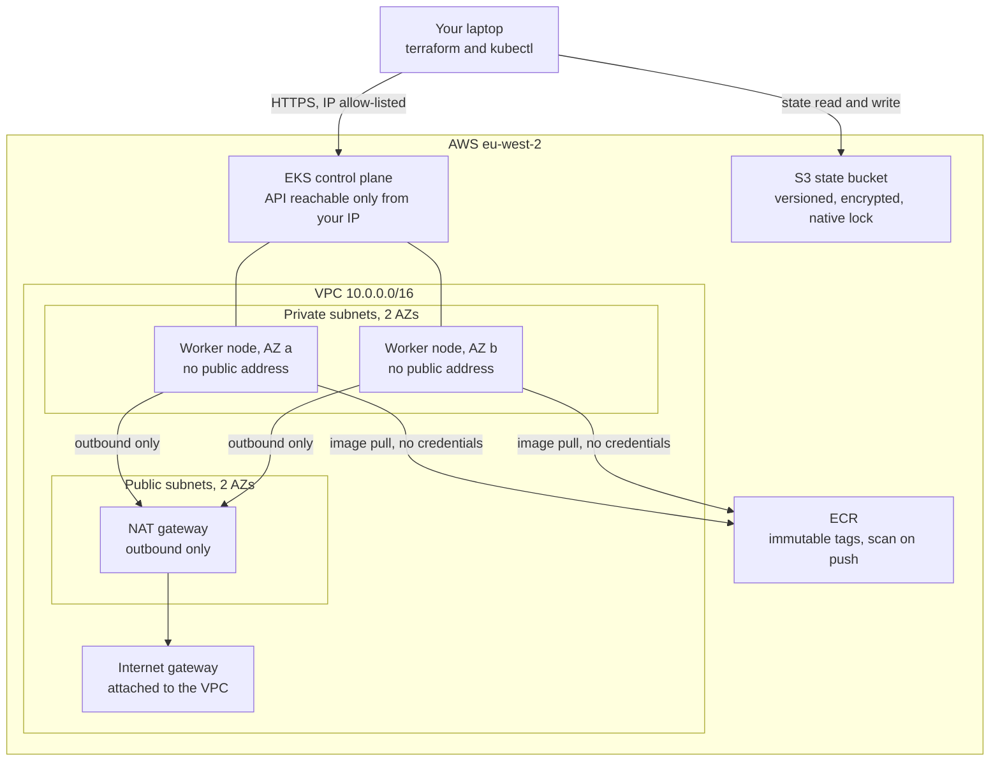

# Architecture

The secure-delivery-platform. This document explains **why** the infrastructure
is shaped the way it is. The code explains what it does; this explains what it
is for.

Sections 1 to 15 cover chapter 1, the AWS foundations. Sections 16 to 22 cover
chapter 2, GitOps delivery with ArgoCD, which runs entirely on the local kind
cluster and costs nothing. Sections 23 to 30 cover chapter 3, supply chain
security: the build pipeline, keyless signing, and the admission policy that
rejects everything it cannot verify.

---

## 1. The premise

The finished platform should be able to make one claim and back it up:

> Nothing runs on this cluster unless it can prove where it came from.

Chapter 1 does not enforce that yet. What it does is build the ground that makes
the claim possible later, and there are only two things in this chapter that
chapter 3 genuinely cannot work without:

1. **The IAM OIDC provider**, because it is what removes access keys from the
   picture entirely.
2. **Immutable ECR tags**, because a signature verified against a mutable tag
   proves nothing.

Everything else here is competent, ordinary infrastructure. Those two are the
load bearing parts.

Chapter 2 adds the second half of the argument. Chapter 1 removed the access key
between the cluster and AWS. Chapter 2 removes the cluster credential from the
delivery pipeline, by making the cluster pull its own configuration rather than
letting anything push to it. Section 17 is that argument in full, and it is the
part of this repository most worth reading.

---

## 2. Shape of the system



Traffic rules that follow from that diagram:

- Nothing in the private subnets has a public IP address. Not the nodes, not the
  pods.
- The internet cannot open a connection to a node. Not because a firewall rule
  says no, but because **there is no route**. Routing is a stronger guarantee
  than a rule, because a rule can be edited by mistake.
- Nodes can reach out, through the NAT gateway, because they need to pull images
  and talk to AWS APIs.
- Nodes pull images from ECR with no stored credentials. Permission comes from the IAM role attached to the node, so there is no key to leak and nothing to rotate.
- The Kubernetes API server is reachable from a single allowlisted CIDR. See
  section 6.

---

## 3. Why hand written modules and not the community ones

`terraform-aws-modules/vpc/aws` and `terraform-aws-modules/eks/aws` are excellent
and in a real job I would probably use them. They handle edge cases this code
does not, they are battle tested across thousands of deployments, and they save a
great deal of time.

They are also roughly 3,000 lines of someone else's abstraction. For a project
whose purpose is to be understood and defended line by line, that is the wrong
trade. This repository is about 350 lines of Terraform resources, all of which
can be read in one sitting.

**The honest position: use the community modules in production, write them
yourself once so you know what they are doing.** Knowing which arguments matter
is what lets you debug the community module when it misbehaves at 2am.

---

## 4. State management

### One bucket, two key prefixes

Both environments share a single S3 bucket and are separated by object key:
`env/dev/terraform.tfstate` and `env/prod/terraform.tfstate`. Separate buckets
per environment would be marginally stronger isolation and considerably more
administration for a single account project.

The bucket has:

- **Versioning.** The most important safety net in Terraform. A corrupted or
  truncated state can be rolled back rather than rebuilt by hand.
- **Lifecycle expiry on old versions.** Versioning without expiry is a slow
  storage leak: every apply writes a new version and nothing removes the old
  ones. 90 days is plenty.
- **A public access block and a bucket policy denying non TLS requests.**
- **`prevent_destroy = true`.** A stray destroy cannot remove the thing holding
  all your state.

### Native S3 locking, no DynamoDB

Terraform 1.10 added `use_lockfile = true`. Terraform writes a zero byte
`<key>.tflock` object next to the state file using an S3 conditional write
(`If-None-Match`), which is atomic. If the object already exists, the lock is
held and the apply is refused. The `dynamodb_table` argument is deprecated.

Why this is better than the old pattern:

- One fewer resource, one fewer IAM policy, one fewer thing billed.
- It removes a real failure mode. With a separate lock table, the table and the
  bucket can drift apart: restore the bucket from a backup and the lock table
  still holds stale rows, or delete the table and locking silently stops working
  with no error.
- The lock now lives in the same consistency domain as the thing it protects.

### The bootstrap chicken and egg problem

`terraform/bootstrap` creates the bucket that everything else stores state in, so
it cannot store its own state there. It uses **local state**, which is gitignored
and never committed.

This is safe because **the bootstrap is reproducible from code**. It declares two
resources. If the local state file is lost, the bucket keeps working and the
state is rebuilt with `terraform import`. The recovery procedure is in the README.

The alternative, committing the state file, would be worse: state files are not
designed to be diffed or merged, and committing one invites someone to edit it.

---

## 5. Cost allocation tags

Every AWS provider block carries a `default_tags` block applying four tags to
every taggable resource:

| Tag | Value | Why |
|---|---|---|
| `Project` | `secure-delivery` | Which system this belongs to |
| `Environment` | `dev` / `prod` / `shared` | Which environment |
| `Owner` | your name | Who to ask at 2am |
| `ManagedBy` | `terraform` | Whether it is owned by code |

`default_tags` matters because it removes the need to remember. A tag policy that
depends on each engineer adding a `tags` block to each resource will be about 80
per cent applied within a month.

**Why these tags are worth the effort:**

1. **Cost allocation.** Once activated as cost allocation tags in the Billing
   console, Cost Explorer can answer "what did dev cost last month" and "what did
   this project cost" directly. Without tags, an AWS account is one
   undifferentiated bill and you are reduced to guessing from resource names.
   This is the difference between "our cloud spend went up 20 per cent" and "the
   dev environment's NAT gateway data processing went up 20 per cent".

2. **Ownership.** When something unexpected is running, `Owner` tells you who to
   ask before you delete it.

3. **Drift detection.** `ManagedBy = terraform` marks what code owns. Anything in
   the account *without* that tag was created by hand, and is a candidate for
   either importing into Terraform or deleting. This is the single most useful
   thing for cleaning up an account that has been managed by hand for years.

4. **Safe automation.** A nightly cleanup job can target `Environment = dev` and
   be confident it will not touch anything else.

One caveat worth knowing: `default_tags` does not propagate to every resource
type. EKS managed node groups do not automatically pass tags down to the EC2
instances they launch, which needs a launch template. That is a known gap in this
chapter.

---

## 6. The Kubernetes API endpoint

This is the decision most worth scrutinising, so here it is in full.

**What the code does:** `endpoint_public_access = true`, with
`public_access_cidrs` as a **required variable with no default**, whose
validation rule **hard rejects `0.0.0.0/0`**.

**Why not just turn the public endpoint off?** Because with
`endpoint_public_access = false`, reaching the API server requires being inside
the VPC. That means running a bastion host (about $4/month plus the operational
burden of a host that must itself be hardened, patched and audited, which is
partly why the Ansible role exists) or a site to site VPN (about $36/month). For
a single operator portfolio project, that is real cost and complexity for a
threat model that does not have an attacker on the operator's home network.

**Why not leave it at `0.0.0.0/0` like most tutorials?** Because an open
Kubernetes API endpoint is exactly the sort of thing this project exists to argue
against. It is also genuinely dangerous: the endpoint is unauthenticated at the
network layer, so anyone can reach it and start probing.

**The compromise, and its honest weakness:** access is restricted to one CIDR,
which is a home broadband address. That address changes, which produces an
occasional Terraform diff. It is also shared with everything else on that
network. This is weaker than a bastion, and it is much stronger than nothing.

**What production would do:** `endpoint_public_access = false`, with access
through a bastion in the public subnet or a site to site VPN, and the bastion
itself hardened by the Ansible role in this repository, reachable only via
Session Manager rather than SSH. That is written down here rather than built,
because building it would cost money this project does not need to spend.

The accepted risk is recorded formally in
[`.trivyignore.yaml`](../.trivyignore.yaml).

---

## 7. The NAT gateway decision

`nat_gateway_count` defaults to `1`.

| Value | Cost | Behaviour |
|---|---|---|
| 1 | about $36/month | One shared gateway. If its AZ fails, **both** AZs lose egress. |
| 2 | about $72/month | One per AZ. Survives an AZ failure. No cross AZ data transfer charges on egress. |

**This is a deliberate cost decision, not a limitation, and the distinction
matters.**

The module already creates **one private route table per availability zone**,
even when there is only one NAT gateway. Route tables are free. This means moving
to one gateway per AZ is `nat_gateway_count = 2` and nothing else: no routing
refactor, no restructuring, no new resources to write.

The reasoning: a single NAT gateway is a single point of failure for egress. What
that actually breaks is image pulls and outbound API calls. Pods already running
keep serving traffic. For a development environment, and for a portfolio project
where the cluster is destroyed most evenings, spending $36/month to protect
against an AZ failure that would need to coincide with a deployment is poor value.

For a production system carrying real traffic, set it to 2. The lever is there
because the decision belongs to whoever is paying the bill, not to the module.

**A cheaper option that was considered and rejected:** a NAT *instance* on a
t4g.nano is about $0.0042/hour, saving roughly $33/month. It was rejected because
it is a single EC2 instance that you have to patch, monitor and replace, and it
becomes a bandwidth bottleneck. Saving $33/month by introducing a host you now
have to operate is a bad trade, and being able to explain why you did **not** do
the cheapest possible thing is worth more than the saving.

---

## 8. Why the IAM OIDC provider is the keystone

Every EKS cluster publishes an OpenID Connect discovery document. Registering it
as an IAM identity provider tells AWS: *trust tokens signed by this cluster.*

Once that exists, an IAM role can carry a trust policy naming a specific
Kubernetes namespace and ServiceAccount:

```json
{
  "Effect": "Allow",
  "Principal": { "Federated": "arn:aws:iam::123456789012:oidc-provider/oidc.eks.eu-west-2.amazonaws.com/id/EXAMPLED539D4633E53DE1B71EXAMPLE" },
  "Action": "sts:AssumeRoleWithWebIdentity",
  "Condition": {
    "StringEquals": {
      "oidc.eks.eu-west-2.amazonaws.com/id/EXAMPLE:sub": "system:serviceaccount:argocd:image-updater",
      "oidc.eks.eu-west-2.amazonaws.com/id/EXAMPLE:aud": "sts.amazonaws.com"
    }
  }
}
```

Any pod using that ServiceAccount receives short lived AWS credentials
automatically, scoped to exactly that role.

**What this replaces:** the alternative is creating an IAM user, generating an
access key, putting it in a Kubernetes Secret, and then owning that secret
forever. That secret is long lived, does not rotate on its own, is base64 encoded
rather than encrypted, is visible to anyone with read access to the namespace,
and is the single most common way cloud credentials leak.

The OIDC provider means the project's rule of *no hardcoded secrets, no access
keys anywhere* is structurally enforced rather than a matter of discipline.
Chapter 3 applies the identical mechanism to GitHub Actions, so the build
pipeline holds no AWS key either. Section 29 is that trust policy line by line.

The same mechanism explains why nodes carry
`AmazonEC2ContainerRegistryReadOnly`: the kubelet pulls from ECR using the node's
instance role, so Deployments have no `imagePullSecrets` at all.

---

## 9. Why ECR tags are immutable

`image_tag_mutability = "IMMUTABLE"`. Once `app:v1.2.3` exists, no push can
replace it.

On a platform whose premise is proving provenance, mutable tags would undermine
everything. You could verify a signature against `app:v1.2.3` on Monday, and on
Tuesday the same tag could point at different bytes, with the admission
controller none the wiser and nothing in the audit trail to show it. The
signature would be verifying a *name*, not an *artefact*.

**The cost:** CI can no longer push `:latest` over and over. Every build must
produce a uniquely tagged image, in practice tagged by commit SHA. That is more
work, and it is also the correct thing to do, because it means every running
image can be traced to exactly one commit.

The lifecycle policy is worth reading for one detail. Rules are evaluated in
**ascending `rulePriority` order and the first match wins**, so the narrow rule
(untagged, expire after 14 days) must have a lower number than the broad one
(keep the last N tagged). Reverse them and the broad rule matches everything
first and the untagged rule never fires. This is a classic ECR mistake and it
fails silently: the policy appears to be configured and simply does not do what
you think.

**Scanning:** `scan_on_push` uses basic scanning, which is free. Amazon Inspector
enhanced scanning is better, because it scans continuously as new CVEs are
published rather than only at push time, and it covers language packages as well
as OS packages. It is billed per image, so basic is the proportionate choice for
this project. Enhanced scanning is the right answer for a real registry, because
the vulnerability that matters is usually one disclosed *after* you pushed.

---

## 10. Dev and prod

The two environments are the same code with different numbers. That is the test
of whether the modules are actually modules.

| | dev | prod |
|---|---|---|
| Applied? | yes | **no, plan only** |
| VPC CIDR | `10.0.0.0/16` | `10.1.0.0/16` |
| NAT gateways | 1 | 1, documented as 2 for real production |
| Node type | t3.small, t3a.small | t3.medium |
| Capacity | SPOT | ON_DEMAND |
| Nodes min/desired/max | 1 / 2 / 3 | 2 / 2 / 4 |
| Node disk | 20 GB | 30 GB |
| Log retention | 7 days | 30 days |
| VPC flow logs | off | on |
| ECR `force_delete` | true | false |
| ECR tagged image cap | 30 | 100 |

Non overlapping VPC CIDRs are deliberate, so the two could be peered later
without renumbering. That costs nothing to decide now and is painful to fix later.

**Spot in dev, on demand in prod.** Spot instances are roughly 65 to 70 per cent
cheaper and can be reclaimed with two minutes' notice. For a dev cluster that is
an acceptable trade and a realistic engineering choice rather than a shortcut. For
production it is not, at least not without a more careful design using mixed
capacity and pod disruption budgets.

**Why prod is plan only.** A `terraform plan` still type checks the whole
configuration, resolves every module input and output, and catches real errors
against a real AWS account: a bad AMI type, an invalid instance family, a
malformed policy document. It proves the modules are reusable. And it
demonstrates production sizing without paying about $185/month for an idle
cluster.

`make apply ENV=prod` and `make destroy ENV=prod` refuse to run, enforced in the
Makefile rather than left to discipline.
[.github/workflows/terraform-plan.yml](../.github/workflows/terraform-plan.yml),
added in chapter 3, runs `terraform plan` against prod on every pull request, so
prod is no longer dead code but a continuously verified specification. It assumes
a **read only** role, separate from the one the build pipeline uses, and runs
with `-lock=false` because a genuinely read only role cannot write the state
lock. Section 29.

---

## 11. Scanning our own infrastructure

The platform verifies container images from chapter 3 onwards. It would be
inconsistent not to hold its own Terraform to the same standard, so `make lint`
runs two IaC scanners over `terraform/`.

**Two scanners, not one**, because they overlap but do not agree. Checkov has
deeper AWS specific policy coverage; Trivy is faster, and also scans for
committed secrets. Running both catches more than either alone, at the cost of
having to suppress each finding twice.

**Suppressions are arguments, not exclusions.** Every suppression carries a
written reason:

- Checkov skips live **inline**, next to the resource, as
  `#checkov:skip=CKV_AWS_nnn:reason`, so the argument is next to the code it
  concerns.
- Trivy suppressions live in **[`.trivyignore.yaml`](../.trivyignore.yaml)**,
  which doubles as a single short accepted risk register that can be read on its
  own.

Current state after chapter 3: **164 Checkov checks pass, 0 fail, 28 are
suppressed with written reasons. Trivy config and secret scans are clean.**

**One of those checks earned its keep during chapter 3.** The read only IAM role
used by the terraform plan workflow originally granted `ec2:Get*`. Checkov failed
it under CKV_AWS_107, credentials exposure, because that wildcard expands to
include `ec2:GetPasswordData`, which returns the encrypted administrator password
of a Windows instance. It was granted to a role that anyone opening a pull
request can assume, in a policy whose entire purpose was to be read only.

It was also not needed, so it was removed rather than suppressed. That is the
outcome this gate exists for, and it is a more useful thing to be able to say
than a clean first draft. The reasoning is left as a comment at the point where
the action used to be, so the absence reads as a decision.

The reverse also happened. Two suppressions written in the first draft, arguing
that the wildcard on `ecr:GetAuthorizationToken` was unavoidable, turned out to
suppress nothing: Checkov does not flag it, because AWS offers no way to scope
that action and the scanner knows it. Both were deleted. **A suppression that
suppresses nothing is noise pretending to be diligence.**

The suppressions fall into three groups:

1. **Cost decisions** (KMS keys for ECR, S3 and EKS Secrets; one year log
   retention). These stop applying the moment this stops being a portfolio
   project.
2. **Scanner limitations.** `CKV_AWS_38` flags the EKS public endpoint because
   Checkov cannot resolve `var.public_access_cidrs` at scan time and assumes the
   worst case. The variable's validation rule makes `0.0.0.0/0` impossible to
   configure. `AVD-AWS-0031` flags the ci registry as not immutable because Trivy
   does not yet recognise `IMMUTABLE_WITH_EXCLUSION`, which AWS added in July
   2025. Section 26 argues why that setting is not the retreat it looks like.
3. **One genuine risk acceptance**, the public API endpoint, argued in full in
   section 6.

Being able to say "our scanner passes clean, and here are the 25 things we
deliberately chose not to fix and why" is a much stronger position than either a
clean scan with the rules turned off, or a red scan everyone has learned to
ignore.

---

## 12. The Ansible role, and what it is honestly for

`ansible/roles/cis_baseline` hardens Ubuntu to CIS Level 1 basics: SSH root login
off, key only authentication, UFW, auditd, unattended security upgrades, password
policy.

**It is not applied to the EKS worker nodes, and it should not be.** Those run
Amazon Linux 2023 from an AWS supplied AMI, they have no SSH access, and drift on
them is fixed by replacing the node rather than by logging in and correcting it.
That is the immutable infrastructure model and it is a better model.

So what is the role for? The Ubuntu hosts that sit around every real platform:
bastions, self hosted CI runners, self managed VMs. Those are pets, they are long
lived, and they need configuration management.

The role is also here because configuration management is a skill a platform
engineer is expected to have, and because contrasting it with the immutable
approach used for the nodes is more interesting than either on its own. **Knowing
when *not* to use Ansible is part of knowing Ansible.**

### The two lockout risks, and how each is prevented

Configuration management on remote hosts has a specific failure mode: you break
the thing you are connected through, and now the host is gone.

1. **A malformed sshd config.** Every template touching sshd uses
   `validate: /usr/sbin/sshd -t -f %s`. Ansible writes the file to a temporary
   location, runs `sshd -t` against it, and only moves it into place if the
   syntax is valid. A typo fails the play instead of breaking the daemon.

2. **Enabling the firewall before allowing SSH.** `firewall.yml` allows the SSH
   port as its **first** task, before the default deny policy is set and before
   UFW is enabled, and asserts at the end that the port is present in the active
   rule set. Getting this order wrong severs your own session.

The role also drops its config into `/etc/ssh/sshd_config.d/` rather than editing
`sshd_config` directly, because a package upgrade can replace the main file and
silently revert the hardening. Drop in files survive upgrades. In OpenSSH the
first occurrence of a keyword wins, and Ubuntu ships the `Include` as the first
line of `sshd_config`, so a drop in file overrides the main config rather than
the reverse.

### Deliberate deviations from strict CIS

- **`max_log_file_action = ROTATE`, not `halt`.** Strict CIS halts the system when
  audit logs cannot be written, on the grounds that unaudited operation is worse
  than no operation. That converts a full disk into an outage. This baseline
  rotates and alerts instead.
- **Immutable audit rules (`-e 2`) commented out.** Correct for a settled
  production host, but it means every subsequent rule change needs a reboot.
- **Automatic reboots after unattended upgrades off by default.** A surprise 03:00
  reboot is its own kind of incident.
- **`pam_faillock`, not `pam_tally2`.** `pam_tally2` was removed in Ubuntu 22.04.
  Configuring it on a modern release does nothing at all, which is worse than no
  lockout because it looks like it is working.

Each is a judgement call about availability against strictness, and each is
annotated in the file where it appears.

One honest note on scope: because the SSH section disables password
authentication entirely, the password policy does not defend the remote login
path. It applies to console logins, sudo prompts and PAM authenticating services.
It is defence in depth, not the front line.

---

## 13. kind, and where the boundary is

`kind/kind-cluster.yaml` is a three node local cluster: one control plane, two
workers. It costs nothing and it is the intended daily workflow.

Two workers rather than one, so scheduling, pod anti affinity and node draining
behave the way they would on a real cluster rather than trivially. The control
plane is labelled `ingress-ready=true`, and container ports 80 and 443 are mapped
through to **host ports 8080 and 8443**, not to 80 and 443, because other local
development stacks on this machine already bind the standard ports.

That detail is load bearing from chapter 2 onwards. Because the kind node holds
8080 and 8443 on the host, everything else has to move: the ArgoCD UI
port-forwards to **8081** and the demo application to **8082**. Those numbers are
in the Makefile rather than in anyone's memory.

### The version gap between here and EKS

| | Kubernetes version |
|---|---|
| kind, local | **1.34** |
| EKS, chapter 1 | **1.35** |

This is a real gap and it is worth knowing rather than discovering. kind ships
the control plane version baked into its node image, so the local version tracks
kind releases rather than what EKS offers. One minor version of drift is normally
harmless, and the places it bites are API deprecations and newly graduated
features: something that works locally on 1.34 can behave differently on 1.35,
and something written against a 1.35 API may not exist locally at all.

Pinning them together is possible, by setting an explicit node image such as
`kindest/node:v1.35.x` in `kind/kind-cluster.yaml` once one is published. It is
deliberately not done yet, because kind node images lag upstream releases and
pinning to an image that does not exist is a worse failure than a version skew
that is written down.

**What kind can do:** everything Kubernetes. Deployments, ArgoCD, admission
policies, ingress, image signature verification against a local registry. Most of
chapters 2 and 3 can be developed here.

**What it cannot do:** IRSA, ECR, ALB, or anything that needs the AWS control
plane. That boundary is exactly where the real cluster is needed, and knowing
where it falls is what keeps the AWS bill near zero.

---

## 14. Known gaps in this chapter

Written down deliberately, because an unlisted gap looks like an oversight and a
listed one looks like a roadmap.

- **No launch template for the node group.** This means IMDSv2 cannot be forced
  to required, and tags do not propagate from the node group to the EC2
  instances. Adding one is straightforward and would be the first thing to fix.
- **Addon versions are not pinned.** AWS selects the default version compatible
  with the cluster version. Pinning is better once there is an upgrade process,
  but a wrong pin blocks cluster upgrades.
- **No cluster autoscaler or Karpenter.** `desired_size` has
  `ignore_changes` set so an autoscaler can own it later without fighting
  Terraform, but nothing is scaling anything yet.
- **No KMS encryption of Kubernetes Secrets by default.** Implemented behind
  `var.kms_key_arn`, off because a key costs about $1/month. Turned on in
  chapter 3 when there are Secrets worth protecting.
- **No private ECR interface endpoints.** The free S3 gateway endpoint covers
  image layer downloads, but ECR API calls still traverse the NAT gateway. At
  about $0.01/hour per endpoint per AZ these pay for themselves only once image
  pulls get busy.
- **`cluster_version` is pinned to a literal.** Verify it is still supported
  before first apply with `aws eks describe-cluster-versions --region eu-west-2`.
  Running an unsupported version moves the cluster onto extended support, which
  costs six times the standard control plane rate.

---

## 15. Cost, in full

Approximate `eu-west-2` list prices. Verify against the AWS pricing calculator
before leaving anything running.

**dev, while running:**

| Item | Hourly | Monthly |
|---|---|---|
| EKS control plane | $0.100 | $73.00 |
| NAT gateway x1 | $0.050 | $36.50 |
| 2 x t3.small SPOT | $0.016 | $11.70 |
| Public IPv4 address | $0.005 | $3.65 |
| 40 GB gp3 EBS | $0.005 | $3.70 |
| ECR and S3 state | ~$0.000 | ~$0.50 |
| **Total** | **~$0.18** | **~$129** |

**prod:** plan only, therefore $0. Applied it would be roughly $0.25/hour, about
$185/month.

**kind:** free.

The uncomfortable number is that **$0.15/hour of the dev figure is EKS control
plane plus NAT gateway**, charged before a single pod runs. That is unavoidable
with this architecture, and it is the honest reason the project is designed
around a free local cluster with short lived AWS environments rather than a
permanently running dev cluster.

Cost controls actually built into the repository:

- `make cost` prints the breakdown.
- `make destroy ENV=dev CONFIRM=yes` requires explicit confirmation.
- `node_max_size` caps how large the bill can grow.
- Log retention is 7 days in dev; CloudWatch log groups are created explicitly so
  EKS cannot create unmanaged ones with infinite retention.
- The ECR lifecycle policy caps stored images.
- prod cannot be applied at all.

---

# Chapter 2: GitOps delivery

Everything from here runs on the local kind cluster. No AWS account is required
and nothing in this chapter costs money.

---

## 16. What GitOps means here, precisely

The term is used loosely enough to be nearly meaningless, so here is the specific
claim this chapter makes.

**A Git repository is the only place the desired state of the cluster is written
down, and a controller running inside the cluster continuously makes reality
match it.**

Three consequences follow, and they are the whole point:

1. **You never deploy.** There is no deploy command, no deploy button and no
   deploy job. You commit. The cluster catches up on its own. (Chapter 3 adds a
   review step in front of that commit, because `main` became protected. It does
   not add a deploy step: the pipeline proposes a change, a human merges it, and
   the cluster still pulls. Section 30.)
2. **The cluster's state is a pure function of a commit.** Not "roughly
   corresponds to", not "was deployed from, plus whatever people did since".
   Drift is detected and undone.
3. **Nothing outside the cluster needs write access to the cluster**, which is
   section 17.

The terms, defined once:

| Term | Meaning |
|---|---|
| **ArgoCD** | The controller that does the reconciling. It runs as pods in the cluster. |
| **Manifest** | A YAML file describing a Kubernetes object. |
| **`Application`** | A custom resource ArgoCD installs. It means "watch this path in this repo and keep it applied here". After install, `kubectl get applications` works like `kubectl get pods`. |
| **Sync** | ArgoCD applying Git to the cluster. |
| **Drift** | The cluster no longer matching Git, usually because a human ran `kubectl edit`. |
| **Self-heal** | ArgoCD undoing drift without being asked. |
| **Prune** | Deleting from the cluster what has been deleted from Git. |
| **Finalizer** | A marker meaning "do not really delete this until its controller has cleaned up". Section 18 is largely about this one. |

---

## 17. The credential argument

This is the security point of the chapter. It is short, and it is the thing to
be able to say out loud.

> **The pipeline never holds cluster credentials, because the cluster pulls from
> Git rather than the pipeline pushing to the cluster. There is no credential to
> steal, because there is no credential.**

### Every credential that exists after chapter 2

| # | Credential | Who holds it | What it can do | Lifetime |
|---|---|---|---|---|
| 1 | kind kubeconfig, a client certificate | You, on your laptop, in `~/.kube/config` | Everything, on the local cluster only | Until the kind cluster is deleted |
| 2 | ArgoCD's ServiceAccount tokens | The cluster, projected into ArgoCD's own pods by the kubelet | Apply manifests cluster wide | Minutes. Auto rotated, audience bound |
| 3 | ArgoCD admin password | Generated into a Secret at install; you read it out once | Log into the ArgoCD UI and CLI | Until changed. The initial Secret should then be deleted |

**That is the entire list. There is no fourth row.**

There is no Git credential, because the repository is public and ArgoCD clones it
anonymously over HTTPS. That was a deliberate choice, not a convenience: a
private repository would need a read only deploy key stored as a Secret in the
cluster, which is a long lived credential that has to be held, rotated and
eventually revoked. Making the repository public removes the row from the table
entirely. There is nothing sensitive in it, and `trivy fs --scanners secret`
gates that claim on every `make lint`.

Note what else is absent:

- **No kubeconfig in any CI system.** There is no CI system yet, and when chapter
  3 adds one, it still will not have a kubeconfig.
- **No AWS credential.** This chapter never touches AWS.
- **No inbound path into the cluster.** No webhook, no callback, no firewall
  hole, no port forwarded from a router.

### Which way the connection goes

```text
   ┌──────────────┐                                   ┌───────────────┐
   │    GitHub    │                                   │  Your laptop  │
   │ (the truth)  │                                   │               │
   └──────┬───────┘                                   └───────┬───────┘
          │                                                   │
          │  ArgoCD dials OUT: HTTPS 443, read only, poll      │ ONE bootstrap
          │                                                    │ kubectl apply
          │  ◄────── no inbound connection, ever ──────►       │
          │                                                    │
   ┌──────┴────────────────────────────────────────────────────┴──────┐
   │  kind cluster                                                    │
   │    argocd namespace ──► reads Git ──► applies to itself          │
   └──────────────────────────────────────────────────────────────────┘
```

**The cluster opens the connection. GitHub never does.** GitHub does not know the
cluster exists. It has no address for it, no credential for it, and no route to
it. If GitHub were wholly compromised tomorrow, the attacker could change what
the cluster *will* pull. They could not connect to it, run a command on it, or
read anything out of it.

### What this replaces

The push model, which is what most pipelines still do:

> A CI runner holds a kubeconfig, or a cloud role with write access to the
> production cluster, and runs `kubectl apply`. That credential lives in a system
> outside the cluster's trust boundary. It is typically long lived. It is
> reachable by anyone who can modify a workflow file in the repository.
> **Compromise of the CI system is compromise of the cluster.** Not an escalation
> path to it. The same thing.

Pull based delivery does not protect that credential better or rotate it faster.
It deletes it, because nothing outside the cluster needs write access to the
cluster any more.

The parallel with chapter 1 is exact and worth drawing. The IAM OIDC provider
removed the AWS access key by letting the cluster prove its identity instead of
presenting a stored secret. GitOps removes the cluster credential by letting the
cluster fetch its own work instead of having work pushed to it. Both replace *a
stored secret* with *a direction of travel*. A direction cannot be leaked.

### The honest rebuttals

Claiming a security property without naming its limits is how you lose the room.
Every one of these is a fair hit.

1. **"You have not removed the credential, you have relocated it."** Partly fair.
   ArgoCD holds broad rights inside the cluster. But the *category* differs: a
   projected ServiceAccount token is short lived, audience bound, and cannot be
   pasted into a settings page. A CI kubeconfig is a long lived file whose entire
   purpose is to be copied somewhere else.

2. **"ArgoCD is now the highest value target on the cluster."** Correct, and it
   should be treated that way. ArgoCD Projects with destination and resource
   allowlists are the mitigation, and they are not built here. Named in section
   22.

3. **"One ArgoCD managing thirty clusters recreates exactly the centralised
   credential store you claim to have removed."** This is the strongest objection
   and it is right. A hub ArgoCD stores credentials for every spoke cluster and
   becomes the crown jewel. The answers are ArgoCD per cluster, or an agent based
   topology where each cluster runs something that pulls. Raise this before
   someone raises it at you.

4. **"Chapter 3 still needs Git write access to bump image tags."** True when
   this was written, and largely answered since. Git write is enormously less
   privileged than cluster write, it is auditable in commit history, and it is
   constrainable with branch protection and required review. **Chapter 3 went on
   to actually constrain it**: `main` is protected, and the pipeline's token can
   push a `deploy/*` branch and open a pull request but cannot merge one or write
   to `main`. Section 30. Downgrading a credential is a real win even when you
   cannot delete it, and this one got downgraded twice.

5. **"Self-heal means you cannot hotfix during an incident."** True, and it is
   the point. The documented escape hatch is
   `argocd app set demo-app --sync-policy none`. Knowing that command before
   three in the morning is the difference between a controlled override and
   somebody panic uninstalling ArgoCD.

6. **"Anyone can read your platform configuration now."** Yes. That is the cost
   of removing the Git credential, and it is acceptable here because the
   repository holds no secrets and is meant to be read. It would be the wrong
   trade for a real organisation, which is why a deploy key is the realistic
   alternative and is described above.

---

## 18. App-of-apps, and what breaks if the root app is deleted

### The problem it solves

You install ArgoCD and now want ten things on the cluster. Each needs an
`Application` object.

The naive approach is ten `kubectl apply` commands. That is ten manual steps,
performed by a human, unrecorded, and if the cluster is rebuilt nobody remembers
which ten. The problem has moved, not gone: the *contents* of each app are in
Git, but the *list of apps* is in someone's shell history.

### The pattern

Create one Application whose job is to deploy the other Applications.

```text
platform/bootstrap/root-app.yaml    one Application, applied by hand exactly once
        │
        │  "watch platform/apps/ and apply everything you find"
        ▼
platform/apps/
    demo-app/application.yaml       another Application
        │
        │  "watch platform/manifests/demo-app/ and apply everything you find"
        ▼
platform/manifests/demo-app/
    namespace.yaml  deployment.yaml  service.yaml
```

Three levels. The root app deploys Applications; those Applications deploy
workloads. The word "app" does double duty, which is why the pattern confuses
people the first time.

The payoff: **adding an eleventh component is a pull request that adds one file
to `platform/apps/`.** No new command, no cluster access, no ArgoCD login for
whoever opens it. Removing a component is deleting that file, and prune tears it
down.

### The rule that keeps it working

`platform/apps/` contains **only `Application` objects and nothing else.**

The root app reads that directory recursively. A Deployment manifest left in
there would be applied straight into the `argocd` namespace, bypassing the child
Application meant to own it. So the workload manifests live in a separate tree,
`platform/manifests/`, which the root app never reads. The separation is
structural rather than a naming convention, so it cannot be got wrong by
accident.

### The root app does not manage itself

`root-app.yaml` lives in `platform/bootstrap/`, outside `platform/apps/`.

Self-managing root apps exist and people use them. It means a bad commit can make
the root app delete itself, or point itself at a wrong path and then be unable to
correct it, because the thing that would fix it is the thing that is broken. For
a chapter about provable delivery, the root app is better as a small, stable,
hand applied artefact that changes about once a year.

### What actually breaks if it is deleted

The answer depends entirely on one line of YAML.

**Case A, with `resources-finalizer.argocd.argoproj.io`.**
`kubectl delete application root -n argocd` becomes a cascading delete. ArgoCD
deletes every child Application, and each child's own finalizer cascades to its
workloads. One command, and the entire platform is gone. The command looks
harmless: it is a six line YAML file being deleted.

**Case B, no finalizer. This is what is built.**
The delete removes only the root object. Every child Application keeps existing
and keeps syncing. **Nothing stops serving and no user notices.**

What is lost is reconciliation of the *list*: new entries in `platform/apps/` are
not picked up, removed ones are not pruned, and a hand deleted child is not
restored. That is a hazard of its own, and a subtle one, because the cluster
looks entirely healthy while silently no longer being GitOps. A broken safety
mechanism that reports green is worse than one that reports red.

Recovery is `kubectl apply -f platform/bootstrap/root-app.yaml`. ArgoCD finds the
children already present and already matching Git, marks them Synced, and adopts
them. No downtime, no recreation. Re-applying is a no-op against a correct
cluster, because the whole system is declarative.

### The decision, and why

**No finalizer on the root. Finalizers on the children.**

The reasoning is blast radius asymmetry, not which failure is more pleasant:

| | One accidental keystroke costs you |
|---|---|
| Finalizer on root | Total platform outage |
| No finalizer on root | A silent no-op, fixed by one idempotent command |

Meanwhile the finalizer genuinely earns its place on the children, because that
is what makes deleting a file from Git actually tear the workload down instead of
orphaning it. That path still works end to end: remove
`platform/apps/demo-app/application.yaml`, the root prunes the child, the child's
finalizer fires, and its Namespace, Deployment and Service go with it.

**Deliberate deletion works. Accidental catastrophe does not.**

The cost, stated plainly: tearing the whole platform down is now a two step
deliberate act rather than one command. That is the intended trade, and it is why
`make argocd-down` deletes the children explicitly before uninstalling the chart.

### The bootstrap chicken and egg

Something has to apply the root app, and that something is one `kubectl apply`
run by a human with a human's credential.

This is exactly the shape of `terraform/bootstrap` in chapter 1, which uses local
state because it creates the bucket everything else stores state in. Both are
safe for the same reason: **the bootstrap is fully reproducible from committed
code.**

**The goal was never zero manual steps. It is exactly one, performed against a
committed file, idempotent, and reproducible on a cluster rebuilt from nothing.**
Every system that pulls its own configuration needs one act to point it at that
configuration.

---

## 19. Installing ArgoCD from a committed values file

`platform/argocd/values.yaml` is committed and `make argocd-up` installs from it.
The chart version is pinned in the Makefile as `ARGOCD_CHART_VER`, currently
`10.2.3`, which is ArgoCD `v3.5.0`.

Pinning matters for the same reason `.terraform.lock.hcl` is committed: an
install that resolves to whatever is newest on the day it runs is not a build, it
is a coincidence. An ad hoc `helm install` with a dozen `--set` flags is a
command someone once ran and half remembers.

The settings worth defending:

| Setting | Value | Why |
|---|---|---|
| `server.insecure` | `true` | **LOCAL ONLY.** The UI is reached by `kubectl port-forward`, which is already an encrypted tunnel through the API server. Running TLS inside that tunnel means a self signed certificate and a browser warning at the start of every demonstration, which teaches viewers to click through certificate warnings. That is a worse outcome than a plaintext hop that never leaves the host. Production terminates TLS at an ingress with a real certificate. |
| `timeout.reconciliation` | `30s` | **LOCAL ONLY.** Default is 180s. Production leaves it there and uses a webhook, which needs GitHub to open an inbound connection. That is impossible here by design, and the impossibility is the security argument. So on kind the poll interval is the only lever. |
| `timeout.reconciliation.jitter` | `5s` | **Easy to miss.** ArgoCD adds random jitter on top of the interval so a controller managing hundreds of apps does not stampede Git. The chart default is 60s, which would have made the real interval 30 to 90 seconds. Setting the interval without the jitter would have looked correct and behaved unpredictably. |
| `dex.enabled`, `notifications.enabled` | `false` | Single sign on and Slack alerts. Neither is used. Fewer pods, less attack surface. |
| `applicationSet.replicas` | `0` | See below. |
| `global.securityContext` | non-root, `RuntimeDefault` seccomp | A platform that will constrain other people's workloads should not ship unconstrained pods itself. |
| resource requests and limits | set on every component | The cluster is a laptop. |

### One finding worth generalising

`applicationSet.enabled: false` was the obvious way to switch off the
ApplicationSet controller. Chart 10.2.3 **has no `enabled` key for that
component**, unlike `dex` and `notifications` which do.

**Helm silently ignores any value the chart does not define.** No error, no
warning, no effect. The values file claimed the controller was off; the pod was
running. It was caught by reading `kubectl get pods -n argocd` against the file,
not by trusting that setting a value had done something.

The available lever is `replicas: 0`. The Deployment and its RBAC still exist,
and removing those needs a post-render hook, which is more machinery than a
stopped pod is worth.

The general lesson: **a Helm values file is a set of requests, not a
specification.** Verify the cluster, not the YAML.

---

## 20. The demo application, and the gap it exposes

`app/src` is a small Go HTTP service. It is boring on purpose: the platform is
the portfolio, not the application. There is no database and no framework.

Four endpoints:

| Path | Purpose |
|---|---|
| `/` | Greeting, version, commit, and **the pod serving it**. The pod name is what makes the self-healing demonstration visible. |
| `/healthz` | Liveness and readiness. |
| `/version` | Provenance: the commit the binary was built from, the build time, and a SHA256 the binary computes **of itself** at runtime by reading `/proc/self/exe`. |
| `/metrics` | Prometheus exposition: custom request counters and histograms, plus the standard Go runtime and process collectors. Nothing scrapes it yet. It exists so chapter 5 is a matter of installing Prometheus rather than editing every workload. |

`/version` is the one that matters later. **In chapter 2** it reported
`image_digest` as explicitly unset, because the image was side-loaded rather than
pulled by digest. **Chapter 3 fills it in**: the pipeline writes `IMAGE_DIGEST`
into the Deployment alongside the image reference, so the endpoint reports the
digest that was signed and verified at admission.

Read section 28, limit 18, before treating that as proof. These are environment
variables, and a pod that lies about its own provenance is trivial to construct.
They are meaningful because of what surrounds them, not because the application
says so. The self-computed `binary_sha256` is
the one provenance claim the application can make without trusting anything else
to have set an environment variable honestly.

The image is a two stage build ending in `gcr.io/distroless/static-debian12:nonroot`:
no shell, no package manager, statically linked, running as UID 65532. The
Dockerfile argues each of those decisions at length, including what they cost,
because that file is what an interviewer will ask about rather than the Go.

### The gap, stated plainly

**There is no registry in this chapter.** The image is built locally and pushed
into the kind nodes with `kind load docker-image`, with
`imagePullPolicy: IfNotPresent`.

So: **the manifests are in Git and provably so. The image bytes are not. They
came from a laptop and nothing verifies them.**

That is a hole in this chapter's own premise, and it is written here rather than
left to be discovered.

**Chapter 3 closes it exactly as described**, and section 23 onwards is that
work: a build pipeline that produces the image, a keyless signature over its
digest, SLSA build provenance, and two admission policies that refuse anything
they cannot verify. The chapter 1 pieces that made it possible were already in
place, the OIDC mechanism and immutable ECR tags.

Naming the gap is what made chapter 3 a plan rather than an afterthought.

---

## 21. Sync policy

Both Applications carry the same policy.

```yaml
syncPolicy:
  automated: {prune: true, selfHeal: true}
  syncOptions:
    - PrunePropagationPolicy=foreground
    - PruneLast=true
    - ServerSideApply=true
  retry: {limit: 5, backoff: {duration: 5s, factor: 2, maxDuration: 3m}}
```

- **`prune: true`** is what makes deleting a file in Git mean something. Without
  it Git is only additive, which is a half truth wearing the costume of a source
  of truth.
- **`selfHeal: true`** makes a manual `kubectl edit` a temporary act rather than
  a permanent undocumented change.
- **`PrunePropagationPolicy=foreground`** deletes owners before dependents and
  waits. The default orphans ReplicaSets and pods behind a deleted Deployment.
- **`PruneLast=true`** prunes removed resources only after new ones are healthy,
  so a rename does not open a gap in service.
- **`ServerSideApply=true`** lets the API server track field ownership, so ArgoCD
  does not fight other controllers over shared objects.

The sharp edge, stated: **prune will delete production if something is removed
from Git carelessly.** The mitigations are review on the pull request, the two
options above, and the `Prune=false` annotation for resources that must never be
removed automatically.

### Namespaces are committed, not created by sync option

ArgoCD offers `CreateNamespace=true`. It works, and it creates a namespace that
exists in the cluster without existing in Git, so nothing reconciles it and prune
would never remove it. That is a small permanent hole in the claim that Git is
the whole truth. `platform/manifests/demo-app/namespace.yaml` closes it. ArgoCD
sorts Namespaces ahead of workloads in its apply ordering, so no sync wave is
needed.

That namespace also carries Pod Security Admission labels at the `restricted`
level. **This is not the admission control chapter 3 is about.** PSA is built
into Kubernetes and makes a claim about runtime privilege; chapter 3 adds a
policy making a claim about provenance. They are complementary and neither
substitutes for the other. It is here because the demo Deployment already
satisfies every constraint, so enforcing them costs nothing today and means a
future manifest that quietly asks for root is refused rather than scheduled.

---

## 22. Known gaps in chapter 2

Written down deliberately, because an unlisted gap looks like an oversight and a
listed one looks like a roadmap.

- **The image is not from Git and not verified.** The largest gap. Section 20.
  **Closed in chapter 3**, sections 23 to 30.
- **ArgoCD is not scoped.** It runs with broad cluster rights and no ArgoCD
  Project restricting destinations or resource kinds. This is the first thing to
  fix on a shared cluster. **Still open**, and it matters more from chapter 3
  onwards, because the same mechanism that delivers the admission policies could
  be used to delete them.
- **`targetRevision: main`**, so any merge to main reaches the cluster within one
  reconciliation interval. Correct for one cluster and one operator; a real
  promotion pipeline pins a tag or a per environment branch.
- **No secret management.** Genuinely out of scope, and better said than
  hand-waved. Committing a Kubernetes Secret to Git is base64, not encryption.
  The real options are Sealed Secrets, SOPS with age, or the External Secrets
  Operator against a real secret store. None is built here.
- **The ArgoCD image is pinned by chart version, not by digest.** The chart pins
  a tag. Digest pinning is stronger, and it is the same argument made for
  immutable ECR tags in chapter 1, so the inconsistency is noted rather than
  defended.
- **No ingress.** Both UIs are reached by port-forward. An ingress controller is
  the right answer for a real cluster and is a second thing to explain.
- **No sync waves or custom health checks.** Not needed for one app with no
  ordering dependencies. Needed the moment something ships CRDs that another app
  depends on. **That moment arrived in chapter 3**, when Kyverno's
  CustomResourceDefinitions had to exist before the policies that use them. Waves
  are now -2 for the engine, -1 for the policies and 0 for the workload.
- **`server.insecure: true`.** Section 19.
- **kind runs Kubernetes 1.34 while EKS runs 1.35.** Section 13.

---

# Chapter 3: supply chain security

The AWS footprint of this chapter is an ECR repository, an IAM identity provider
and two IAM roles. That is roughly a penny a month and no cluster at all.
Everything else, including both admission policies and the demonstration that
they work, runs on the free local kind cluster.

---

## 23. What chapter 3 claims, and the gap it closes

Section 20 named the hole in chapter 2 in plain terms:

> The manifests are in Git and provably so. The image bytes are not. They came
> from a laptop and nothing verifies them.

Chapter 3 closes it, and the claim it makes is this:

> **The cluster will not run an image unless it can prove that this repository's
> pipeline built it, from this repository's source, and that nobody has touched
> the bytes since.**

Note the shape of that sentence. It is not "we sign our images". Signing is the
easy half and on its own it proves nothing, because nothing checks. The half that
matters is the **gate**: an admission controller that rejects an image whose
provenance cannot be established, that you can watch reject a real image, with
the reason on screen.

The terms, defined once.

| Term | Meaning |
|---|---|
| **Supply chain** | Everything between someone typing code and a process running it: source, dependencies, build machine, registry, cluster. Every step is somewhere an attacker can substitute bytes. |
| **Digest** | The SHA256 hash of an image's manifest, written `sha256:abc...`. Computed from the content, so it **is** the content's name. |
| **Tag** | A human friendly label pointing at a digest, like `:0.1.0`. A pointer, not an identity. |
| **Signature** | A cryptographic statement that the holder of a key vouched for a specific digest. |
| **Attestation** | A signed statement **about** an artefact rather than merely over it. Same machinery, structured payload. |
| **SBOM** | Software Bill of Materials. A machine readable inventory of everything in an image. |
| **CycloneDX** | One of the two standard SBOM formats. The other is SPDX. |
| **Syft** | The tool that reads an image and produces the SBOM. |
| **Provenance** | A signed record of *how* an artefact was built: repository, commit, workflow, builder, time. |
| **SLSA** | "Supply chain Levels for Software Artefacts", pronounced salsa. Grades how trustworthy a build process is. |
| **Cosign** | The signing and verification tool from the Sigstore project. |
| **Fulcio** | A certificate authority issuing ten minute signing certificates in exchange for a proven identity. Section 25. |
| **Rekor** | The transparency log. An append only, publicly auditable ledger of signing events. Section 25. |
| **OIDC** | OpenID Connect. One system issues a short lived signed token asserting who the bearer is; another is configured to trust that issuer. Chapter 1 already used it between EKS and IAM. |
| **Admission controller** | Code in the API server's request path that can accept, modify or reject an object **before** it is written to etcd. |
| **Kyverno** | A policy engine that runs as an admission controller, with policies written as Kubernetes resources rather than as code. |

The three things chapter 1 built that this chapter genuinely could not work
without, exactly as predicted in section 1: **the OIDC mechanism**, so nothing
holds an access key; **immutable ECR tags**, so a verified signature stays
meaningful; and **the `/version` endpoint** from chapter 2, which has been
reporting `image_digest` as explicitly unset since the day it shipped and now
reports the digest that was signed and verified.

---

## 24. Signing by tag against signing by digest

This is the most important idea in the chapter, and it is worth being precise
about because it already caused a real incident in chapter 2.

### The chapter 2 incident, which needed no attacker

The demo image was rebuilt under the same `0.1.0` tag. The Deployment manifest
still said `image: demo-app:0.1.0`, byte for byte identical to what was already
applied. Kubernetes compared the pod template, found no change, and correctly did
nothing. The running pods kept serving the old binary.

Nothing failed. Nothing logged an error. ArgoCD reported `Synced` and `Healthy`
throughout, and it was right on both counts: the cluster genuinely did match Git.
The system was correct and the deployment was a lie.

That is the whole problem in miniature, and it did not require a malicious actor,
a compromised registry or a clever attack. It required a rebuild.

### The same bug with an attacker attached

1. The pipeline builds good bytes, tags them `:1.4.2`, and signs the tag.
2. An attacker with registry push access repoints `:1.4.2` at their own bytes.
3. Admission verifies the signature on `:1.4.2`. It passes. The malicious image
   runs.

At no point in that sequence is a signature broken or a check skipped. The
signature verified precisely what it was asked to verify: **a name**. Nobody
asked about the bytes.

A tag is a mutable pointer. Signing one produces a statement of the form "a label
called 1.4.2 was blessed at some point", which is not a useful thing to know.

### Why the digest fixes it

A digest is the SHA256 of the image manifest. It is derived from the content, so
it is not a label attached to the content, it **is** the content's name. Change
one byte and you have a different digest, and therefore a different artefact with
a different name. There is no pointer to move.

### Both halves are needed, and they are separate requirements

**The policy must verify by digest.** Kyverno's `verifyImages` rule sets
`verifyDigest: true` and `mutateDigest: true`. If a pod arrives referencing a
tag, Kyverno resolves that tag, verifies those bytes, and then **rewrites the pod
spec** to the digest it resolved. Without the rewrite there is a window between
"Kyverno resolved the tag and verified those bytes" and "the kubelet resolved the
same tag and pulled whatever it pointed at by then". That is a time of check to
time of use gap, and mutating the spec closes it.

**The manifest must reference a digest.** This is what
[platform/manifests/demo-app/deployment.yaml](../platform/manifests/demo-app/deployment.yaml)
now does, written by the pipeline. It matters for three reasons beyond
verification:

- ArgoCD's diff becomes meaningful. A new build changes the manifest, so a
  rollout actually happens. The chapter 2 incident becomes impossible.
- Git records exactly what is running. `git log` on that one line is a deployment
  history.
- The kubelet pulls exactly the bytes that were verified, with no second
  resolution step in between.

Chapter 1's immutable ECR tags are the third layer. They mean a tag cannot be
repointed at all, so the attack above fails at step 2 rather than at step 3. But
immutability is a registry setting somebody can change, and it only holds inside
one registry. Deploying by digest holds regardless of the registry. Neither is
trusted alone, which is the same reasoning the Dockerfile gives for stating
`USER 65532` explicitly rather than relying on the `:nonroot` base tag.

---

## 25. Keyless signing, and what the transparency log is for

### The problem with keys

The traditional model is: generate a keypair, keep the private key secret
forever, publish the public key. The difficulty is the word *forever*. The key
has to be reachable by a build machine, which means a CI secret, a KMS key or an
HSM.

A CI secret is a long lived credential. Chapters 1 and 2 spent their entire
effort deleting exactly those. Reintroducing one in order to prove a point about
supply chain security would be self defeating.

### What replaces the private key

**Keyless signing does not remove the key. It removes the key's lifetime.**

1. Cosign generates a keypair **in memory** on the runner. It has never existed
   before and will never exist again.
2. GitHub Actions issues an OIDC token asserting the identity of the running job.
   Not "clinton" and not "a runner", but this exact string:

   ```text
   https://github.com/clintonsenaye/secure-delivery-platform/.github/workflows/build-sign-attest.yml@refs/heads/main
   ```

3. Cosign sends the ephemeral **public** key and that token to **Fulcio**. Fulcio
   validates the token against GitHub's published keys and issues an X.509
   certificate binding the public key to that identity. **The certificate is
   valid for ten minutes.**
4. Cosign signs the image digest with the ephemeral private key.
5. Cosign records the signature, the certificate and the digest in **Rekor**.
6. **The private key is discarded.** It never touched disk and never left the
   runner's memory.

What replaces the private key is **an identity plus a timestamp**. Verification
does not ask "is this the right key". It asks "was this signed by a certificate
Fulcio issued to *this workflow*, while that certificate was valid".

There is nothing to store, rotate, revoke or leak. The signing key existed for
under ten minutes and does not exist anywhere now.

The parallel with the rest of the project is exact and worth drawing out loud.
The IAM OIDC provider replaced a stored AWS access key with a proof of identity.
GitOps replaced a stored cluster credential with a direction of travel. Keyless
signing replaces a stored signing key with a proof of identity. **All three
replace a secret with something that cannot be copied.**

### What Rekor is actually for

The signing certificate expired ten minutes after it was issued. Verification
happens weeks later. So how does a verifier know the signature was made while the
certificate was valid, rather than afterwards by whoever obtained the key?

**That is Rekor's primary job, and it is more prosaic than the name suggests.**
Rekor is an append only log with a Merkle tree structure, so retroactive edits
are detectable. When Cosign signs, it submits the event and Rekor returns a
**signed timestamp** proving the entry existed at that moment. At verification
time, Cosign fetches the Rekor entry and checks the signing timestamp falls
inside the certificate's ten minute window.

Without Rekor, a ten minute certificate would be useless for verifying anything
older than ten minutes.

The secondary job is the one the word transparency advertises:

- **Detection, not prevention.** If Fulcio were compromised and issued a
  certificate impersonating this workflow, that would not be prevented. But the
  fraudulent signature has to appear in a public, append only log, so it can be
  found. This is exactly the design of Certificate Transparency for TLS, and for
  the same reason: you cannot stop a certificate authority lying, but you can
  stop it lying *quietly*.
- **A public history.** Anyone can audit what has ever been signed as this
  project, without asking this project.

The honest caveats. This uses the **public good** Sigstore instance, run for free
by the Linux Foundation, so every signature and every identity string is public.
There is nothing sensitive in that here. Verification also depends on Rekor being
reachable, which is an availability dependency on a third party, discussed in
section 28. And **nothing in this project monitors Rekor**. The detection
mechanism exists and nobody is watching it, which is listed as a gap in section
30 rather than glossed over.

---

## 26. The registry, and two ways it quietly breaks signing

Chapter 1 set `image_tag_mutability = "IMMUTABLE"` and section 9 argued at length
that this was one of the two load bearing decisions in the chapter. Chapter 3
then discovers that the same setting breaks Cosign, and that the ECR lifecycle
policy will eventually delete your signatures. Both are worth knowing before they
happen, because both fail in confusing ways.

### One: Cosign stores signatures as tags

Cosign does not push a signature as a distinct kind of object. It pushes it to
the same repository under a **derived tag**. An image with digest `sha256:abc...`
gets its signature at `sha256-abc....sig` and its attestations at
`sha256-abc....att`.

Attaching a second attestation to an image means **updating an existing tag**,
which a fully immutable repository refuses. Signing appears to work and then
fails on the second attestation, with a registry error about immutability that
looks like a permissions problem.

The tempting fix is to set the repository to `MUTABLE`, which discards the
guarantee section 9 called load bearing. This project takes the narrow fix
instead. AWS added `IMMUTABLE_WITH_EXCLUSION` in July 2025:

```hcl
image_tag_mutability = "IMMUTABLE_WITH_EXCLUSION"
image_tag_mutability_exclusion_filters = ["sha256-*"]
```

Application tags stay immutable. Only the `sha256-*` namespace becomes writable.

**Why that exclusion is safe rather than merely convenient.** A Cosign metadata
tag is derived from the digest of the thing it describes, so it is already
content addressed. Overwriting `sha256-abc....sig` can only change the metadata
attached to that one digest. It cannot make a signature apply to different bytes,
which is the entire attack immutable tags exist to prevent. An attacker who could
write into that namespace could add or replace a signature; they could not make
Kyverno accept it, because the policy pins the signing identity.

The `dev` environment is unchanged and still fully `IMMUTABLE`, because the
exclusion list defaults to empty.

### Two: the lifecycle policy eats your signatures

Chapter 1's lifecycle policy said "keep only the most recent 30 tagged images".
That rule counts `.sig` and `.att` artefacts as images. Every build produces two
of them, so a cap of 30 is reached after roughly ten builds, at which point ECR
starts expiring the oldest tagged artefacts. Those are the signatures of the
images deployed first, which are the images most likely to still be running.

**The failure is quiet and delayed.** Nothing breaks at expiry time, because the
pods are already admitted and admission has already happened. It surfaces weeks
later when a node is replaced or a pod is rescheduled, the image is re-admitted,
and Kyverno reports "no matching signatures" for an image that was signed
correctly and verified fine on the day it was deployed. Working out why costs an
afternoon.

The fix is to give each class of artefact its own rule, keyed on tag prefix:

| Priority | Matches | Action |
|---|---|---|
| 1 | untagged | expire after 14 days |
| 2 | `sha256-*` | keep the most recent 90 |
| 3 | `sha-*` | keep the most recent 30 |
| 4 | any | catch-all cap |

The rule priority discipline from section 9 still applies and now matters more:
rules are evaluated in ascending order, the first match wins, an image is never
acted on by more than one rule, and ECR requires the `any` rule to carry the
highest number. Get the order wrong and the broad rule matches everything first
while the narrow rules never fire, silently.

---

## 27. Where the AWS boundary falls, and the credential this chapter adds back

### Keeping the AWS surface small was a design goal, so here it is explicitly

| Component | Runs where | Cost |
|---|---|---|
| GitHub OIDC identity provider | **real AWS**, IAM | free |
| Two IAM roles, push and plan | **real AWS**, IAM | free |
| ECR repository for signed images | **real AWS**, ECR | ~$0.01/month |
| The whole build pipeline | GitHub, public repo | free |
| Fulcio, Rekor, signing, transparency log | Sigstore public good | free |
| Kyverno engine and both policies | **kind** | free |
| ArgoCD child apps and sync waves | **kind** | free |
| Admission denial and the bypass demonstration | **kind** | free |
| **EKS, VPC, NAT gateway** | **not needed at all** | **$0** |

**The last line is the point.** Chapter 3 does not need the EKS cluster. The
three things that must be real are identity federation, an IAM role and a
registry, and all three are effectively free. `make apply ENV=dev` and its
$130/month stays destroyed.

This is why [terraform/environments/ci](../terraform/environments/ci) is a
separate root module rather than a few resources bolted onto `dev`. Adding them
to `dev` would have tied running the pipeline to applying an EKS control plane
and a NAT gateway. There is a second reason too: the `dev` registry is destroyed
whenever `dev` is destroyed, taking every signed image and every signature with
it. A registry whose lifecycle is bound to an ephemeral cluster is the wrong
shape for a registry.

**What genuinely cannot be proven without EKS**, stated rather than claimed:
IRSA supplying Kyverno's registry credentials, and the node role pulling from ECR
with no image pull secret. Both are the subject of the next part.

### The credential inventory, updated honestly

Section 17 listed three credentials and said, in bold, that there was no fourth
row. Chapter 3 adds rows. Pretending otherwise would undo the credibility that
table bought.

| # | Credential | Held by | Can do | Lifetime |
|---|---|---|---|---|
| 1 | kind kubeconfig | You, on your laptop | Everything, local cluster only | Until the cluster is deleted |
| 2 | ArgoCD ServiceAccount tokens | Projected into ArgoCD's pods | Apply manifests cluster wide | Minutes, auto rotated |
| 3 | ArgoCD admin password | A Secret, read once | Log into ArgoCD | Until changed |
| 4 | **GitHub Actions OIDC token** | GitHub, per job | Be exchanged for the AWS role, and obtain a Fulcio certificate | ~15 minutes |
| 5 | **AWS STS session** | The runner, in memory | Push to **one** ECR repository | 1 hour, never stored |
| 6 | **`GITHUB_TOKEN`, `contents` and `pull-requests: write`** | GitHub, per job | Push a `deploy/*` branch and open a pull request. **Cannot merge one, and cannot write to `main`** | The job |
| 7 | **ECR pull secret in `demo` and `kyverno`** | **The kind cluster** | Pull images and read signatures from ECR | **12 hours, refreshed by hand** |
| - | **The Cosign signing key** | **nobody** | | **does not exist** |

**There is no eighth row, and in particular there is no repository secret.**

That is worth dwelling on, because it was nearly lost. Rows 4, 5 and 6 are minted
per job by GitHub and expire with the run; none of them is stored anywhere a
human could copy, and none can be pasted into a settings page. **Row 7 is the
only genuine stored secret in the entire project, and it exists purely because
this runs on kind.**

Chapter 3 came within one design decision of adding a permanent one. Branch
protection made the delivery automation open a pull request, and GitHub will not
trigger checks on a pull request opened with `GITHUB_TOKEN`, so the required
check could never pass on its own. The obvious fix was a GitHub App, whose
installation token does trigger workflows, at the price of storing its private
key as a repository secret forever.

**That trade was declined.** The pull request is opened with `GITHUB_TOKEN` and a
human closes and reopens it, which takes two clicks and triggers the gate under
their own identity. Section 30 sets out all five options and why this one is
right at this volume and wrong at scale.

The result is that chapter 2's claim survives chapter 3 intact rather than with
an asterisk: **nothing outside the cluster holds a credential that can write to
it, and nothing in this repository holds a stored credential at all.** A build
pipeline that signs container images, pushes to a private registry and commits to
a protected branch, with zero secrets configured, is the strongest single thing
this project can point at.

Note what row 6 no longer says either. Before branch protection it read "Commit
to this repository", meaning `main`. It now cannot write to `main` at all. That
is a credential downgrade achieved by a control outside this repository, which is
the most durable kind.

On EKS, row 7 disappears entirely. The kubelet pulls from ECR using the node's
instance role, which is why section 8 could say Deployments have no
`imagePullSecrets` at all, and Kyverno reads the registry through IRSA by setting
`imageRegistryCredentials.providers: [amazon]` instead of naming a secret. A kind
node has no AWS identity, so the stand in is a docker config secret built from
`aws ecr get-login-password`.

That token lasts **twelve hours**. When it expires, image pulls fail with a 401
and Kyverno reports what looks like a signature failure and is actually an
authentication failure. `make ecr-login` refreshes both copies and restarts the
Kyverno admission controller, which caches its registry clients.

There is a second, subtler cost. **That secret cannot be in Git**, because it
contains a bearer token.
[platform/manifests/demo-app/serviceaccount.yaml](../platform/manifests/demo-app/serviceaccount.yaml)
references a secret that a human creates out of band, so ArgoCD will happily sync
a ServiceAccount into a cluster where that secret does not exist. That is a real
hole in "Git is the whole truth", it is the same class of hole that
`CreateNamespace=true` would have opened in section 21, and unlike that one it
cannot be closed without a secret management tool. Sealed Secrets, SOPS with age
or the External Secrets Operator are the real answers, and section 22 already
listed the absence of secret management as a known gap. Chapter 3 is where that
gap starts to cost something.

---

## 28. What this does NOT protect against

Claiming a security property without naming its limits is how you lose the room.
Every one of these is a fair hit, and several are the first thing a competent
reviewer will reach for.

### What a signature genuinely does not say

1. **A signed backdoor is still signed.** The policy proves origin and integrity.
   It says nothing about whether the code is correct, safe or benign. Provenance
   is not quality.

2. **Anyone who can merge to `main` can get anything signed.** The pipeline signs
   whatever is in the repository. The security boundary has **moved** to branch
   protection and code review, not disappeared. Branch protection is now on, so
   that boundary is enforced rather than aspirational, but note what it means:
   the strength of every signature in this project is now the strength of the
   review on the pull request that produced it. Section 30.

3. **A malicious dependency is signed too.** If a Go module in `go.sum` is
   compromised upstream, the pipeline builds it, signs it, and truthfully attests
   that it was built from this repository. All correct, all useless. The SBOM
   makes the blast radius discoverable afterwards; it prevents nothing.

4. **A compromised runner or a malicious third party action can sign arbitrary
   bytes** with the legitimate identity, because it has the OIDC token. Pinning
   every action to a commit SHA reduces this and does not remove it. A GitHub
   hosted runner on a public repository is not a hardened isolated builder, so
   the honest SLSA claim here is roughly level 2 provenance authenticity rather
   than level 3.

5. **The base image is trusted implicitly.** `gcr.io/distroless/static-debian12`
   is itself signed by Google with Cosign, and this pipeline does not verify that
   signature. A complete supply chain policy verifies its own base images.

6. **The SBOM is best effort.** Syft infers components from package metadata. A
   vendored or statically embedded dependency with no metadata does not appear,
   and the SBOM will confidently not mention it.

### What the admission gate does not cover

7. **It gates admission, not runtime.** Once a pod is admitted, nothing
   re-verifies it. Tightening the policy tomorrow does not touch what is already
   running.

8. **Anyone with RBAC over Kyverno wins.** Editing the `ClusterPolicy`, deleting
   the `ValidatingWebhookConfiguration`, or scaling the Kyverno deployment to
   zero all bypass the gate completely. This protects against unsigned images,
   not against a cluster administrator.

9. **Deleting a policy file from Git silently disables the gate.** Prune is on,
   so removing `policies/require-signed-images.yaml` in a one line pull request
   removes the policy from the cluster. Nothing stops serving, no alert fires,
   and every Application still reports Synced and Healthy. The mitigation is
   branch protection and review, which is a process control rather than a
   technical one.

10. **`failurePolicy: Fail` is a deliberate availability trade.** Set to `Fail`,
    Kyverno being unreachable means nothing can be admitted to the demo
    namespace. Set to `Ignore`, Kyverno being unreachable means everything is
    admitted and the gate becomes a suggestion that still reports green. This
    project chooses `Fail` and accepts that the gate can cause an outage, because
    a security control that fails open is theatre. With one admission controller
    replica on kind, a pod restart is a brief window of refused admissions.

11. **Excluded namespaces are a bypass route.** Kyverno excludes `kube-system`
    and its own namespace by default, to avoid deadlocking the cluster. Anything
    that can schedule a pod into an excluded namespace escapes the gate.

12. **Scoped to the `demo` namespace only.** Every other namespace on this
    cluster, including `argocd` and `kyverno` itself, is entirely unprotected.
    Kyverno runs an image these policies have never looked at.

### Trust model and operational limits

13. **Verification depends on the public good Sigstore instance being available
    and honest.** Rekor unreachable, combined with `failurePolicy: Fail`, means
    no deployments. A compromised Fulcio could issue a certificate for this
    identity, and the transparency log lets you *detect* that afterwards, which
    is not the same as preventing it.

14. **Nothing monitors Rekor** for signatures claiming this project's identity.
    The detection mechanism exists and nobody is watching it.

15. **Scan results are a snapshot.** Trivy reflects its vulnerability database at
    build time. An image that scans clean today is vulnerable the moment a CVE is
    published, and nothing rescans what is running.

16. **The image scan passes `--ignore-unfixed`.** An unfixed CRITICAL in the base
    image will not stop a deployment. The reasoning is in the workflow file: a
    finding this pipeline cannot act on does not make the image safer when it
    fails the build, it just teaches people to route around the gate. The
    compensating control is the distroless base, which has almost no packages to
    be vulnerable in the first place.

17. **The account ID is public.** The digest reference committed to a public Git
    repository contains it. An account ID is not a secret and grants nothing on
    its own, but it does help an attacker enumerate role names. Accepted, and
    recorded here rather than discovered.

18. **`/version` reports what it was told.** `IMAGE_REF` and `IMAGE_DIGEST` are
    environment variables, and a pod that lies about its own provenance is
    trivial to construct. They are meaningful only because the same commit that
    set them is the commit ArgoCD applied, and because Kyverno verified the
    signature over that digest before the pod was allowed to exist. The endpoint
    is a window onto a fact established elsewhere, not the evidence itself. The
    one claim the application can make unaided is `binary_sha256`, which it
    computes of itself at runtime from `/proc/self/exe`.

---

## 29. The GitHub OIDC trust policy, line by line

This is the piece most worth reading carefully, because the failure modes are
severe and none of them produces an error message.

```json
{
  "Effect": "Allow",
  "Principal": { "Federated": "arn:aws:iam::<acct>:oidc-provider/token.actions.githubusercontent.com" },
  "Action": "sts:AssumeRoleWithWebIdentity",
  "Condition": {
    "StringEquals": {
      "token.actions.githubusercontent.com:aud": "sts.amazonaws.com",
      "token.actions.githubusercontent.com:sub": "repo:clintonsenaye@57267374/secure-delivery-platform@1323617369:ref:refs/heads/main"
    }
  }
}
```

If that `sub` value looks like it has been mangled, it has not. Those numbers are
GitHub's **immutable identifiers**, and the subsection below is about why they
are there, what they defend against, and how their absence broke this pipeline in
a way that produced no error message anywhere a developer would look.

**`sts:AssumeRoleWithWebIdentity`, not `sts:AssumeRole`.** The caller presents a
token signed by a trusted issuer rather than an existing AWS identity, which is
what removes the need for a stored AWS credential to bootstrap from.

**The `aud` condition.** Without it, a GitHub token minted for some other
audience, for example a third party service that also accepts GitHub OIDC, could
be replayed here.

**The `sub` condition. This is the line the whole pipeline rests on.** The
failure modes, in increasing order of how bad they are:

| Written as | Who can assume the role |
|---|---|
| omitted entirely | **Any GitHub Actions workflow in any repository on GitHub** |
| `StringLike`, `repo:*` | the same thing with extra steps |
| `StringLike`, `repo:owner/*` | any repository you own, including one created five minutes ago by an attacker who compromised a single collaborator account |
| `StringLike` over the ID portion | nothing gained. An identifier matched with a wildcard is a name again |
| `StringEquals`, names but no IDs | this repository, **or anything that later takes this repository's name.** See below |
| `StringEquals`, repository only, no ref | any branch, including one pushed by somebody with write access but no review rights |
| `StringEquals`, IDs and ref | only what is written |

The first row is not a subtle misconfiguration. It is a public role, and it is a
well known real world mistake.

**Branch scoping does more than it looks like.** A pull request run receives the
claim `repo:OWNER@ID/NAME@ID:pull_request`, with no ref component at all. That
does not match, so **a pull request cannot obtain AWS credentials**. This is why the
pipeline has a separate scanning job and building job rather than one job with an
`if` condition: an `if` can be edited in the same pull request it is meant to
constrain, and a trust policy cannot.

**Two roles, not one.** The read only role used by
[.github/workflows/terraform-plan.yml](../.github/workflows/terraform-plan.yml)
*does* accept the `pull_request` claim, because a plan on a pull request is the
whole point of it. Giving that role push access would let an unreviewed pull
request publish an image. Separating them is what makes "a pull request can look
but not touch" true by construction rather than by policy.

The plan role also gets no write permission at all, which is why the workflow
runs `terraform plan -lock=false`: acquiring the S3 native lock means writing a
`.tflock` object, and a role that can still write a lock file is not read only.

### Immutable identifiers, and the day the trust policy stopped matching

This is the part of chapter 3 that was learned rather than designed, so it is
written up as it happened.

#### The symptom

Every run of the build workflow failed at the `configure-aws-credentials` step.
Not intermittently: every time, immediately, with a message that amounted to
"not authorized to perform sts:AssumeRoleWithWebIdentity".

That message is unhelpful in a specific and frustrating way. It is what you get
when the role does not exist, when the OIDC provider is not registered, when the
audience is wrong, when the subject is wrong, and when the role's trust policy
is fine but its permissions are not. Five very different problems, one error.

**And the workflow log never prints the token.** It cannot: the OIDC token is a
credential, and a runner that echoed it into a public build log would be handing
out the ability to assume the role. So the one piece of information needed to
tell those five cases apart, the actual `sub` claim GitHub sent, is deliberately
absent from the place everybody looks first.

#### The diagnosis, from CloudTrail

The claim is absent from the workflow log. It is not absent from **CloudTrail**,
because AWS records what it was asked to do and why it declined.

`sts:AssumeRoleWithWebIdentity` appears in CloudTrail as a management event
whether it succeeds or fails, and a failed one carries both the `errorMessage`
and, critically, the subject claim AWS evaluated. So the question stops being
"why is my trust policy wrong" and becomes the far more answerable "what string
did AWS actually compare against, and what string did I write".

```bash
aws cloudtrail lookup-events \
  --lookup-attributes AttributeKey=EventName,AttributeValue=AssumeRoleWithWebIdentity \
  --max-results 10 \
  --query 'Events[].CloudTrailEvent' --output text \
  | jq -r 'select(.errorCode != null)
           | {error: .errorCode, message: .errorMessage,
              sub: .requestParameters.subjectFromWebIdentityToken,
              role: .requestParameters.roleArn}'
```

What came back was this:

```text
repo:clintonsenaye@57267374/secure-delivery-platform@1323617369:ref:refs/heads/main
```

against a trust policy that said:

```text
repo:clintonsenaye/secure-delivery-platform:ref:refs/heads/main
```

Which is the entire diagnosis. `StringEquals` has no opinion about how nearly two
strings match, and it was right to refuse.

**The lesson is more general than this one bug.** When a federated identity is
refused, the log on the *asking* side tells you the request failed and the log on
the *answering* side tells you what was asked. Reach for the answering side
first. In this project the same shape applies to Kyverno: `kubectl` prints that a
pod was rejected, and the Kyverno admission controller's log prints what it
compared. Two logs, and only one of them contains the fact.

#### What immutable identifiers are

Every GitHub account and every repository has a permanent numeric ID, assigned at
creation and never reused or changed. `clintonsenaye` is a display name that can
be changed on a whim; `57267374` is what that account *is*. The same holds for
repositories: `secure-delivery-platform` is a label, `1323617369` is the object.

Until July 2026 GitHub's OIDC subject claim used only the labels:

```text
repo:OWNER/NAME:ref:refs/heads/BRANCH
```

Since **15 July 2026** it carries both, with the ID attached to each name:

```text
repo:OWNER@OWNER-ID/NAME@REPO-ID:ref:refs/heads/BRANCH
```

The `@` separator is not arbitrary. It was chosen because `@` cannot appear in a
GitHub username or repository name, so the delimiter can never be mistaken for
part of a name no matter what anybody calls their repository. That is the same
class of reasoning as choosing a field separator that cannot occur in the data,
and it is the sort of small decision that stops a parsing bug becoming a security
bug.

The rollout matters for anyone reading this and finding their own policy still
works:

- Repositories **created after 15 July 2026** use the new format automatically.
- Repositories **renamed or transferred after that date** adopt it.
- **Existing repositories keep the old format until they opt in**, through a
  toggle in the repository or organisation OIDC settings.

So a trust policy written from a tutorial in 2025 keeps working, right up until
the day somebody renames a repository, and then fails closed with the unhelpful
error above. The failure is delayed, unrelated to any change in the
infrastructure code, and triggered by an action that looks purely cosmetic.

#### The attack this prevents

Here is why the change was made, and it is worth spelling out because "use IDs,
they are more permanent" sounds like housekeeping rather than security.

The old claim named a repository **by a name that can be released.**

1. You write a trust policy for `repo:acme/deployer:ref:refs/heads/main`. The
   role can push images to your production registry.
2. Time passes. The project is renamed, or archived and deleted, or the
   organisation is restructured, or somebody transfers it. The name `acme/deployer`
   becomes available.
3. The trust policy is not updated, because nothing appeared to break. Nothing
   *did* break: there is simply no longer anything using it.
4. Somebody creates a repository at `acme/deployer`. On a personal account, this
   requires only that the account name is available too, and account names are
   released when accounts are deleted or renamed.
5. They add a workflow with `permissions: id-token: write`, request an OIDC token
   with audience `sts.amazonaws.com`, and present it to your account.
6. **The claim matches.** AWS validates the token against GitHub's published
   keys, which is correct: GitHub really did issue it. It checks the audience,
   which is correct. It compares the subject, which is byte for byte the string
   your policy trusts. It hands over credentials.

At no point does anything malfunction. Every component behaves exactly as
designed. The vulnerability lives entirely in the gap between "a name" and "the
thing that had that name when I wrote this down".

With immutable identifiers the attacker's repository has a different ID, because
IDs are never reused, so their claim is a different string and `StringEquals`
declines. The window closes not because the attack is detected but because it
cannot be expressed.

This is a real class of vulnerability rather than a hypothetical. It is the same
shape as a dangling DNS record pointing at a released cloud resource, and it has
the same character: nothing is broken, an identifier simply outlives the thing it
identified.

#### Why IDs are the stronger choice for this project specifically

Chapter 3 exists to make one claim: *the cluster will not run an image unless it
can prove that this repository's pipeline built it.* Every layer is built to
resist an identifier being reinterpreted.

- Section 24 rejected image tags in favour of digests, because a tag is a name
  that can be repointed and a digest is the content.
- Section 26 kept the registry immutable, so a tag cannot be reassigned even in
  the registry that owns it.
- The Kyverno policies pin an exact certificate subject rather than accepting any
  signature, because "signed" is not the same as "signed by us".

**Matching on repository names would have been the one place the project trusted
a mutable label**, and it would have been the trust boundary that mattered most:
the thing that decides who may push a signed image at all. A verified signature
over a digest, produced by a pipeline whose AWS access is governed by a name
anybody could later claim, is a very strong chain with its first link made of
string.

The IDs make the trust policy say what the rest of the chapter says: *this exact
object, which has existed since a specific moment and can never be anything
else*, rather than *whatever currently answers to this name*.

#### What this does and does not buy

Being precise, because the summaries of this change tend to blur two properties.

**It buys unforgeability.** No other repository, now or ever, can produce this
claim. That is the security property and it is the reason for the change.

**It does not buy immunity from your own renames.** The names are still in the
claim alongside the IDs, so renaming this repository changes the string and the
trust policy stops matching until `github_repository` is updated in
`terraform.tfvars`. That is a deliberate acceptance rather than an oversight: it
fails closed, it fails immediately, and it fails in a way that is fixed by a
reviewed Terraform change. A trust boundary that silently follows a rename is
convenient in exactly the way this whole section argues against.

An alternative exists. AWS now supports GitHub specific condition keys, including
`repository_id`, `repository_owner_id` and `actor_id`, which can be matched
independently of the subject. A policy conditioned on `repository_id` alone
*would* survive a rename. It is deliberately not used here, for two reasons.
First, the subject claim is what
`sts:AssumeRoleWithWebIdentity` is actually about, and expressing the boundary in
one condition that reads like a sentence is worth more than expressing it in
three that have to be assembled. Second, matching `repository_id` without also
pinning the ref would silently drop the branch restriction, and losing branch
scoping to gain rename tolerance is a bad trade for a project whose pipeline
signs artefacts.

#### What was NOT changed, and why that took discipline

The obvious reaction to "the identity format changed" is to update every place an
identity appears. That would have broken things that were working.

The Kyverno policies in [policies/](../policies/) pin this identity:

```text
https://github.com/clintonsenaye/secure-delivery-platform/.github/workflows/build-sign-attest.yml@refs/heads/main
```

with no numeric IDs in it, and they were left alone. **That is a different
claim.** AWS validates `sub`. Fulcio builds the signing certificate's subject
alternative name from `job_workflow_ref`, which is a URL and has always been a
URL. The July 2026 change was to `sub`, so image verification was never affected
by the failure that broke role assumption.

Changing the policies to chase a format they do not use would have converted one
broken thing into two, and the second would have been much harder to diagnose,
because a signature verification failure and a signature *policy* typo produce
the identical message: `no matching signatures`.

Stated honestly: that is reasoning, not observation. This project has not yet
produced a signature whose certificate could be read. The build workflow verifies
its own output against a reconstructed identity before it commits anything, which
is exactly the step that will catch it if the reasoning is wrong, and it will
catch it in the pipeline rather than at admission time on a cluster.

### Three smaller things worth knowing

- **`ecr:GetAuthorizationToken` has to be on `"*"`.** It is a registry level
  action with no repository ARN to attach to. It returns a login token whose
  actual scope is still governed by the other statements, so the wildcard grants
  the ability to authenticate rather than the ability to push. Everything that
  moves bytes is scoped to one repository ARN.
- **An AWS account holds exactly one OIDC provider per issuer URL.** If another
  project registered GitHub first, `terraform apply` fails with
  `EntityAlreadyExists`. The module takes a `create_oidc_provider` boolean and
  looks up the existing one instead.
- **The thumbprint is vestigial.** Since 2023, IAM validates
  `token.actions.githubusercontent.com` against a trusted root certificate
  authority and ignores the thumbprint list, which is why the SHA1 fingerprint a
  hundred tutorials tell you to paste has changed twice without breaking anyone.
  It is left empty deliberately, because supplying a stale value implies it
  matters.

### The stronger version, not built

`sub: repo:OWNER@ID/NAME@ID:environment:production`, combined with a GitHub
environment carrying protection rules, requires a human approval before the role
can be assumed at all. It is one line and it is the correct production answer. It is not
built here because a single operator approving their own deployments is ceremony
rather than control.

---

## 30. Branch protection, and the automation that had to obey it

This section is the second thing in chapter 3 that was learned rather than
designed. It is here because the failure is instructive: **a security control
was added, and the first thing it broke was the delivery pipeline.**

### What happened

The gap list at the end of this chapter opened with this entry:

> **No branch protection on `main`.** The single largest gap, and the one that
> most weakens the claim. The gate proves an image came from this pipeline; the
> pipeline builds whatever is on `main`. Requiring review before merge is what
> makes "from this repository" mean something.

So it was turned on: a pull request required, and the **Secret and vulnerability
gate** check required.

The next build succeeded through every step. Scans passed, the OIDC role
assumption worked, the image was pushed, scanned, given an SBOM attestation,
signed, and given SLSA provenance, and the workflow verified all three against
its own identity. Then the deploy job tried to push the digest to `main` and was
refused:

```text
remote: error: GH013: Repository rule violations found for refs/heads/main.
remote: - Changes must be made through a pull request.
```

Three times, because the deploy job retried on any push failure and rebased
between attempts. That retry loop was written for a concurrent merge, which is a
real thing that a rebase does resolve. **A rule violation is not a race.** It
does not become true on the third attempt and rebasing cannot make it true. All
the loop achieved was to print the one useful line three times and then close
with a message about rebasing, which pointed the reader away from the cause.

That is fixed too, and the fix is a classifier rather than a counter: refusals
fail immediately with an explanation, races are retried, and anything
unrecognised fails immediately rather than being retried hopefully. **Three
identical failures with an unhelpful message are worse than one clear one**,
because the repetition reads like a transient problem and invites you to re-run.

### The choice

There were three ways forward, and only one of them is defensible.

#### Rejected: exempt Actions from the ruleset

GitHub rulesets take a bypass list, and adding the Actions app to it would have
made the original pipeline work again with no code change at all. It is the
fastest fix and it is the wrong one.

**The rule exists to constrain exactly this actor.** The pipeline is not an
incidental writer to `main`; it is *the* thing whose commits reach the cluster.
Every other contributor's changes have to pass through review specifically
because they might end up deployed. Exempting the one actor that deploys, from
the one control that reviews what gets deployed, leaves a rule that constrains
only the people who were already going to open a pull request.

There are two secondary reasons, and the first is the one that would show up
later:

- **A bypass entry is invisible from the code.** Someone reading
  `build-sign-attest.yml` would see an ordinary `git push origin HEAD:main` and
  have no way to learn that it is privileged. The fact that makes the pipeline
  special would live in a settings page, in a different system, with no history
  in this repository. Chapter 1 made the same argument about
  `make apply ENV=prod` being refused in the Makefile rather than left to
  discipline: **put the constraint where the reader is.**
- **It keeps the credential strong.** A token that can push to a protected
  `main` is materially more powerful than one that can push a branch and open a
  pull request. Section 17's whole argument is about downgrading credentials
  rather than protecting them better.

#### Rejected: point ArgoCD at an unprotected branch

Protect `main`, have the pipeline push freely to a `deploy` branch, and change
`targetRevision` in the ArgoCD Applications to track that instead.

This is worse than the bypass, because it *looks* like it preserves the control.
It does not. **Whatever branch ArgoCD tracks is production.** Protecting `main`
while deploying from an unprotected branch protects the branch nobody deploys
from. The review requirement would apply to a branch with no path to the
cluster, and the branch with a direct path to the cluster would have no review
requirement at all.

It would also break something chapter 2 spent a section establishing: that the
cluster's state is a pure function of a commit on the default branch, so `git
log` on `main` is the deployment history. Splitting those apart means the
question "what is running" stops being answerable from the obvious place.

The general shape is worth naming, because it recurs: **a control moved off the
path it was meant to guard is not a weakened control, it is a decoration.** It
still reports green, which makes it worse than not having it.

#### Chosen: make the automation follow the rule

The deploy job now does what a human contributor does. It creates a branch,
commits the digest rewrite to it, pushes the branch, and opens a pull request
against `main`. It cannot merge that pull request, and it is not meant to be
able to.

Nothing about the rule was changed, and nothing was exempted from it. The
automation is simply a contributor that happens not to be a person, held to the
identical standard, and the standard is enforced by GitHub rather than by
anything in this repository choosing to comply.

Two properties fall out of that, and both are worth more than the convenience
that was given up:

- **The deploy pull request is a review surface.** It carries the image
  reference, the digest, the source commit and a link to the build run that
  produced and verified it. Approving it is a deliberate act with the evidence
  attached, rather than a commit that appeared on `main` overnight.
- **Chapter 2's rebuttal 4 is now much less of a concession.** That rebuttal
  admitted the pipeline still needed Git write access, and consoled itself that
  Git write is auditable and *constrainable* with branch protection. It is now
  actually constrained rather than theoretically constrainable.

### The part that does not work by default, and the five ways out

Making the automation follow the rule immediately runs into a rule of GitHub's
own:

> events triggered by the `GITHUB_TOKEN`, with the exception of
> `workflow_dispatch` and `repository_dispatch`, will not create a new workflow
> run

This exists to stop workflows recursing, and this very pipeline relied on it as a
loop guard. It also means **a pull request opened with `GITHUB_TOKEN` never
triggers the gate.** The required check sits at "Expected, waiting" and the pull
request cannot be merged as it stands. The automation would be following the rule
in form while being structurally unable to satisfy it. A change GitHub rolled out
in mid 2026 tightened this further: workflows triggered by pull requests the
Actions bot created are held for manual approval even where they do run.

There are five ways out of that, and the interesting thing is that the right one
depends entirely on **how often you deploy**. That is not usually how security
decisions are framed, and it should be more often.

#### 1. Close and reopen the pull request by hand. CHOSEN.

Closing and reopening produces a `reopened` event attributed to a person rather
than to the token. The gate runs, the check goes green, and the pull request
becomes mergeable. It works because the `pull_request` trigger's default event
types are `opened`, `synchronize` and `reopened`, and this workflow does not
override them.

**Cost: two clicks per deploy. Credentials stored: none.**

The deploy job prints the instruction with the pull request URL every time, as a
job summary and as a run annotation, so it is not something to remember. It is
the normal path, documented as such, rather than a fallback that fires when
something is missing.

#### 2. Scope the ruleset so the gate is not required on `deploy/*`

Rulesets can target specific branch patterns, so `main` could require the gate
while deploy branches did not.

**This is genuinely defensible, and more so than it first sounds.** The gate
scans source: secrets across the whole Git history, and known vulnerabilities in
dependencies. A deploy pull request contains **one line**, a digest, generated by
a build in which that same gate already ran and passed over that same tree. Re-
running it proves nothing new. Requiring it there is ceremony, and ceremony that
costs two clicks every deploy.

It is rejected for now on a maintenance argument rather than a security one: it
means a second ruleset to keep correct, and rulesets live in a settings page
rather than in this repository. A rule that exists only in a web UI is a rule
nobody reviews, and the next person to widen its pattern by accident gets no
diff, no pull request and no reviewer. The same argument section 30 already makes
against the bypass list applies, in smaller print.

**This is the first thing to change if the deploy volume rises.**

#### 3. Have a human make the commit

Delete the deploy job. Read the digest out of the build summary and edit
`deployment.yaml` yourself.

Rejected, but worth stating because it is the honest baseline the automation has
to beat. It is not obviously worse than option 1: both need a human, and this one
needs no pipeline code at all. What it loses is that the digest is transcribed by
hand, and a digest is sixty-four characters that mean nothing to a person. **The
one thing humans are reliably bad at is copying long hex strings correctly**, and
the failure mode is a manifest referencing an image that does not exist or, far
worse, one that does. The automation is not saving effort here; it is removing a
transcription error from the one value in this project that must be exact.

#### 4. A personal access token

Same capability as an App, longer lifetime, tied to a person rather than to an
installation, and it carries that person's access to everything else they can
reach. If the account gains access to another repository next month, so does this
pipeline, silently.

Rejected outright. It is strictly worse than option 5 on every axis, and option 5
was itself rejected.

#### 5. A GitHub App

An App's installation token triggers workflows normally, so the gate runs on the
deploy pull request exactly as it would on a human's. The token is short lived,
an hour, and scoped to one repository and two permissions. **This is what a
company deploying many times a day should do**, and it is the answer the GitHub
documentation points at.

Rejected here, and the reason is arithmetic rather than principle. The App
requires storing its private key as a repository secret, permanently. This
project currently has **zero** stored credentials: no AWS access key, because
identity is proved rather than presented; no signing key, because signing is
keyless; no cluster credential, because the cluster pulls. Adding a permanent
secret to save two clicks, at a volume of roughly one deploy every few days, is a
bad trade. At fifty deploys a day it is an obviously good one.

### Right at this volume, wrong at scale

Stating that plainly, because it is the part worth defending out loud rather than
the part worth hiding.

**This choice is correct at one deploy every few days and incorrect at fifty a
day.** Nothing about the security reasoning changes with volume. What changes is
the denominator: a fixed, permanent credential risk divided by an increasing
number of manual interventions it removes. At low volume the manual step is
cheap and the credential is expensive. At high volume the manual step becomes the
bottleneck, people start looking for ways around it, and a control people route
around is worse than one that costs a secret.

**The order I would move in as volume rises is option 2, then option 5.**

Option 2 first, because it costs no credential at all and it is the change with
the honest argument behind it: the gate scans source, and a generated one line
digest bump is not source. It also has a natural ceiling, in that it only helps
if deploy pull requests really are trivial, which stops being true the moment
anything else is automated onto that branch.

Option 5 second, when the deploy pull request stops being trivial or when the
manual step is being skipped in practice. At that point the App key is a
proportionate cost, and it should be introduced as a deliberate, documented
addition to the credential inventory in section 27 rather than as a convenience.

**What should not happen is drifting into option 5 quietly**, which is the normal
way projects acquire their first stored secret: a thing was inconvenient once,
somebody fixed it, and nobody wrote down that the inventory changed.

### What this cost

Two things, and both are worth stating rather than glossing.

**Deployment is no longer continuous.** A signed image sits in a pull request
until somebody merges it, which for a single operator project means it deploys
when the operator is at a keyboard.

**And merging it takes three interactions rather than one:** close the pull
request, reopen it so the gate runs, then review and merge. The middle one is
pure friction with no security value, and it exists only because GitHub declines
to trigger checks on a pull request its own token opened.

Both are the correct trade here, because the thing being gated is *what runs in
the cluster*, and because the alternative to the middle one is a permanent stored
credential. They would be the wrong trade for a system that needs to ship a fix
at three in the morning. The answer there is not to remove the gate but to make
satisfying it fast: option 2 above removes the reopen step entirely, and the
review itself is already cheap because the diff is one generated line with the
evidence attached in the pull request body, approvable from a phone.

### One consequence that is easy to miss

The loop guard changed shape and got weaker, and the workflow file used to claim
otherwise.

`build-sign-attest.yml` skips builds for pushes that only touch
`platform/manifests/**`, because otherwise recording a digest triggers a build
that produces a new digest. The `BUILD_TIME` build argument means every rebuild
produces different bytes and therefore a different digest, so that loop does not
converge on its own.

That filter used to be described as the second of two independent guards, the
first being that `GITHUB_TOKEN` pushes do not trigger workflows. **The first
guard is gone**, because the digest now reaches `main` through a merge performed
by a human, and a human merge triggers workflows exactly as it should.

The path filter still holds: for a push to an existing branch GitHub takes a
two-dot diff between the old and new tip, so merging a deploy pull request
presents exactly one changed file. That is true for merge, squash and rebase
merges alike, because the deploy branch always carries exactly one commit
touching exactly one path. It fails open in two documented cases, a push of more
than 1,000 commits and a diff that times out, neither of which this pipeline can
produce.

The practical backstop is now that **every iteration of a runaway loop would need
a human to merge a pull request.** So it cannot run away unattended. That is a
sound backstop and it is also a conditional one: **if auto-merge is ever enabled
on deploy pull requests, it disappears and a second explicit guard is needed.**
That condition is written in the workflow file next to the filter, because it is
the sort of thing that gets enabled by someone who has not read this section.

A related trap, from the same corner of GitHub's behaviour: a workflow skipped by
path filtering leaves its checks *Pending*, and a pull request requiring those
checks is then blocked forever. That does not bite here only because the
`pull_request` trigger deliberately carries no path filter. Adding one, as a
tidying-up exercise, would deadlock every deploy pull request.

---

## 31. Known gaps in chapter 3

Written down deliberately, because an unlisted gap looks like an oversight and a
listed one looks like a roadmap.

- **CLOSED: no branch protection on `main`.** This was the largest gap in the
  list. It is now on, requiring a pull request and the secret and vulnerability
  gate. Closing it broke the delivery pipeline, and the fix was to make the
  automation obey the rule rather than be exempted from it. Section 30.
- **Every deploy needs a manual close and reopen.** GitHub will not trigger the
  required check on a pull request opened by `GITHUB_TOKEN`, so a person has to
  reopen it. This is a deliberate choice over storing a GitHub App private key,
  and it is a gap in the sense that it is friction with no security value: it is
  right at this deploy volume and wrong at scale. Section 30 records all five
  options and the order to move through them as volume rises.
- **Deployment is no longer continuous.** A signed image waits in a pull request
  for a human. Correct for what is being gated, and a real cost. Section 30.
- **Renaming this repository breaks deployments until Terraform is updated.**
  The immutable IDs in the OIDC subject claim survive a rename, but the names
  sitting beside them do not, so the claim changes and `StringEquals` stops
  matching. It fails closed and it fails immediately, which is the right
  direction, but it fails with the same unhelpful "not authorized to perform
  sts:AssumeRoleWithWebIdentity" as everything else. The fix is one value in
  `terraform.tfvars` and the diagnosis is in section 29. Accepted rather than
  solved: the alternative, conditioning on `repository_id` instead of `sub`,
  would drop the branch restriction unless it were rebuilt separately.
- **The policies cover one namespace.** Section 28, limit 12. The real pattern is
  to enforce cluster wide and carve out the few namespaces that genuinely cannot
  comply.
- **Kyverno's own images are not verified.** Nor are ArgoCD's, nor the distroless
  base. The platform holds workloads to a standard it does not yet meet itself.
- **No ArgoCD Project restricting destinations or resource kinds.** Carried over
  from section 22, and it matters more now: the same mechanism that delivers the
  policies could be used to delete them.
- **The SBOM attestation is produced but not required at admission.** Both
  policies check the signature and the provenance. Nothing requires an SBOM to be
  present. That is a deliberate scope decision rather than an oversight: an SBOM
  is an inventory, not a trust claim, and requiring one at admission tests
  whether a document exists rather than whether it is true.
- **Nothing monitors Rekor.** Section 28, limit 14.
- **One Kyverno admission controller replica.** Correct for a laptop, wrong
  anywhere else, and with `failurePolicy: Fail` it means a pod restart is a brief
  admission outage. Production is three replicas with a PodDisruptionBudget.
- **The ECR pull secret is not in Git and expires every 12 hours.** Section 27.
  It disappears on EKS.
- **No image signature verification at the registry level.** ECR supports
  pull-through policies and AWS Signer; this project verifies only at admission.
  Defence in depth would do both, so that an image cannot even be pulled without
  a valid signature.
- **`cosignOCI11: true` on the provenance policy is the fiddliest
  interoperability point in the chapter.** GitHub's attestation is stored using
  the OCI 1.1 referrers API, and registries that do not implement it fall back to
  a tag schema. If the signature policy passes and the provenance policy fails,
  that flag is the first thing to change.
- **The Dockerfile's base images are pinned by tag, not by digest.**
  `golang:1.25-alpine` and `gcr.io/distroless/static-debian12:nonroot` are both
  mutable references. This is the exact inconsistency section 24 spends two pages
  arguing against, applied to the one place chapter 3 did not fix. It is listed
  rather than defended. The reason it has not been done is prosaic: a digest
  pinned base has to be bumped by hand or by a tool on every upstream security
  patch, and Dependabot's Docker ecosystem support updates tags more reliably
  than digests. That is a reason, not a justification.
- **Chart and image versions are pinned but not verified.** ArgoCD and Kyverno
  are both installed from pinned Helm chart versions, which is reproducible. A
  pinned version is not a verified artefact, and chapter 2 already flagged the
  same inconsistency for the ArgoCD image.
