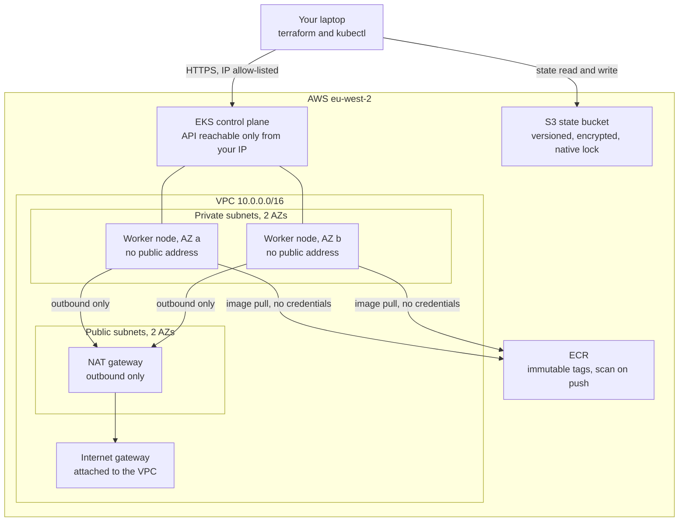

# Architecture

Chapters 1 and 2 of the secure-delivery-platform. This document explains **why**
the infrastructure is shaped the way it is. The code explains what it does; this
explains what it is for.

Sections 1 to 15 cover chapter 1, the AWS foundations. Sections 16 to 22 cover
chapter 2, GitOps delivery with ArgoCD, which runs entirely on the local kind
cluster and costs nothing.

---

## 1. The premise

The finished platform should be able to make one claim and back it up:

> Nothing runs on this cluster unless it can prove where it came from.

Chapter 1 does not enforce that yet. What it does is build the ground that makes
the claim possible later, and there are only two things in this chapter that
chapter 3 genuinely cannot work without:

1. **The IAM OIDC provider**, because it is what removes access keys from the
   picture entirely.
2. **Immutable ECR tags**, because a signature verified against a mutable tag
   proves nothing.

Everything else here is competent, ordinary infrastructure. Those two are the
load bearing parts.

Chapter 2 adds the second half of the argument. Chapter 1 removed the access key
between the cluster and AWS. Chapter 2 removes the cluster credential from the
delivery pipeline, by making the cluster pull its own configuration rather than
letting anything push to it. Section 17 is that argument in full, and it is the
part of this repository most worth reading.

---

## 2. Shape of the system



Traffic rules that follow from that diagram:

- Nothing in the private subnets has a public IP address. Not the nodes, not the
  pods.
- The internet cannot open a connection to a node. Not because a firewall rule
  says no, but because **there is no route**. Routing is a stronger guarantee
  than a rule, because a rule can be edited by mistake.
- Nodes can reach out, through the NAT gateway, because they need to pull images
  and talk to AWS APIs.
- Nodes pull images from ECR with no stored credentials. Permission comes from the IAM role attached to the node, so there is no key to leak and nothing to rotate.
- The Kubernetes API server is reachable from a single allowlisted CIDR. See
  section 6.

---

## 3. Why hand written modules and not the community ones

`terraform-aws-modules/vpc/aws` and `terraform-aws-modules/eks/aws` are excellent
and in a real job I would probably use them. They handle edge cases this code
does not, they are battle tested across thousands of deployments, and they save a
great deal of time.

They are also roughly 3,000 lines of someone else's abstraction. For a project
whose purpose is to be understood and defended line by line, that is the wrong
trade. This repository is about 350 lines of Terraform resources, all of which
can be read in one sitting.

**The honest position: use the community modules in production, write them
yourself once so you know what they are doing.** Knowing which arguments matter
is what lets you debug the community module when it misbehaves at 2am.

---

## 4. State management

### One bucket, two key prefixes

Both environments share a single S3 bucket and are separated by object key:
`env/dev/terraform.tfstate` and `env/prod/terraform.tfstate`. Separate buckets
per environment would be marginally stronger isolation and considerably more
administration for a single account project.

The bucket has:

- **Versioning.** The most important safety net in Terraform. A corrupted or
  truncated state can be rolled back rather than rebuilt by hand.
- **Lifecycle expiry on old versions.** Versioning without expiry is a slow
  storage leak: every apply writes a new version and nothing removes the old
  ones. 90 days is plenty.
- **A public access block and a bucket policy denying non TLS requests.**
- **`prevent_destroy = true`.** A stray destroy cannot remove the thing holding
  all your state.

### Native S3 locking, no DynamoDB

Terraform 1.10 added `use_lockfile = true`. Terraform writes a zero byte
`<key>.tflock` object next to the state file using an S3 conditional write
(`If-None-Match`), which is atomic. If the object already exists, the lock is
held and the apply is refused. The `dynamodb_table` argument is deprecated.

Why this is better than the old pattern:

- One fewer resource, one fewer IAM policy, one fewer thing billed.
- It removes a real failure mode. With a separate lock table, the table and the
  bucket can drift apart: restore the bucket from a backup and the lock table
  still holds stale rows, or delete the table and locking silently stops working
  with no error.
- The lock now lives in the same consistency domain as the thing it protects.

### The bootstrap chicken and egg problem

`terraform/bootstrap` creates the bucket that everything else stores state in, so
it cannot store its own state there. It uses **local state**, which is gitignored
and never committed.

This is safe because **the bootstrap is reproducible from code**. It declares two
resources. If the local state file is lost, the bucket keeps working and the
state is rebuilt with `terraform import`. The recovery procedure is in the README.

The alternative, committing the state file, would be worse: state files are not
designed to be diffed or merged, and committing one invites someone to edit it.

---

## 5. Cost allocation tags

Every AWS provider block carries a `default_tags` block applying four tags to
every taggable resource:

| Tag | Value | Why |
|---|---|---|
| `Project` | `secure-delivery` | Which system this belongs to |
| `Environment` | `dev` / `prod` / `shared` | Which environment |
| `Owner` | your name | Who to ask at 2am |
| `ManagedBy` | `terraform` | Whether it is owned by code |

`default_tags` matters because it removes the need to remember. A tag policy that
depends on each engineer adding a `tags` block to each resource will be about 80
per cent applied within a month.

**Why these tags are worth the effort:**

1. **Cost allocation.** Once activated as cost allocation tags in the Billing
   console, Cost Explorer can answer "what did dev cost last month" and "what did
   this project cost" directly. Without tags, an AWS account is one
   undifferentiated bill and you are reduced to guessing from resource names.
   This is the difference between "our cloud spend went up 20 per cent" and "the
   dev environment's NAT gateway data processing went up 20 per cent".

2. **Ownership.** When something unexpected is running, `Owner` tells you who to
   ask before you delete it.

3. **Drift detection.** `ManagedBy = terraform` marks what code owns. Anything in
   the account *without* that tag was created by hand, and is a candidate for
   either importing into Terraform or deleting. This is the single most useful
   thing for cleaning up an account that has been managed by hand for years.

4. **Safe automation.** A nightly cleanup job can target `Environment = dev` and
   be confident it will not touch anything else.

One caveat worth knowing: `default_tags` does not propagate to every resource
type. EKS managed node groups do not automatically pass tags down to the EC2
instances they launch, which needs a launch template. That is a known gap in this
chapter.

---

## 6. The Kubernetes API endpoint

This is the decision most worth scrutinising, so here it is in full.

**What the code does:** `endpoint_public_access = true`, with
`public_access_cidrs` as a **required variable with no default**, whose
validation rule **hard rejects `0.0.0.0/0`**.

**Why not just turn the public endpoint off?** Because with
`endpoint_public_access = false`, reaching the API server requires being inside
the VPC. That means running a bastion host (about $4/month plus the operational
burden of a host that must itself be hardened, patched and audited, which is
partly why the Ansible role exists) or a site to site VPN (about $36/month). For
a single operator portfolio project, that is real cost and complexity for a
threat model that does not have an attacker on the operator's home network.

**Why not leave it at `0.0.0.0/0` like most tutorials?** Because an open
Kubernetes API endpoint is exactly the sort of thing this project exists to argue
against. It is also genuinely dangerous: the endpoint is unauthenticated at the
network layer, so anyone can reach it and start probing.

**The compromise, and its honest weakness:** access is restricted to one CIDR,
which is a home broadband address. That address changes, which produces an
occasional Terraform diff. It is also shared with everything else on that
network. This is weaker than a bastion, and it is much stronger than nothing.

**What production would do:** `endpoint_public_access = false`, with access
through a bastion in the public subnet or a site to site VPN, and the bastion
itself hardened by the Ansible role in this repository, reachable only via
Session Manager rather than SSH. That is written down here rather than built,
because building it would cost money this project does not need to spend.

The accepted risk is recorded formally in
[`.trivyignore.yaml`](../.trivyignore.yaml).

---

## 7. The NAT gateway decision

`nat_gateway_count` defaults to `1`.

| Value | Cost | Behaviour |
|---|---|---|
| 1 | about $36/month | One shared gateway. If its AZ fails, **both** AZs lose egress. |
| 2 | about $72/month | One per AZ. Survives an AZ failure. No cross AZ data transfer charges on egress. |

**This is a deliberate cost decision, not a limitation, and the distinction
matters.**

The module already creates **one private route table per availability zone**,
even when there is only one NAT gateway. Route tables are free. This means moving
to one gateway per AZ is `nat_gateway_count = 2` and nothing else: no routing
refactor, no restructuring, no new resources to write.

The reasoning: a single NAT gateway is a single point of failure for egress. What
that actually breaks is image pulls and outbound API calls. Pods already running
keep serving traffic. For a development environment, and for a portfolio project
where the cluster is destroyed most evenings, spending $36/month to protect
against an AZ failure that would need to coincide with a deployment is poor value.

For a production system carrying real traffic, set it to 2. The lever is there
because the decision belongs to whoever is paying the bill, not to the module.

**A cheaper option that was considered and rejected:** a NAT *instance* on a
t4g.nano is about $0.0042/hour, saving roughly $33/month. It was rejected because
it is a single EC2 instance that you have to patch, monitor and replace, and it
becomes a bandwidth bottleneck. Saving $33/month by introducing a host you now
have to operate is a bad trade, and being able to explain why you did **not** do
the cheapest possible thing is worth more than the saving.

---

## 8. Why the IAM OIDC provider is the keystone

Every EKS cluster publishes an OpenID Connect discovery document. Registering it
as an IAM identity provider tells AWS: *trust tokens signed by this cluster.*

Once that exists, an IAM role can carry a trust policy naming a specific
Kubernetes namespace and ServiceAccount:

```json
{
  "Effect": "Allow",
  "Principal": { "Federated": "arn:aws:iam::123456789012:oidc-provider/oidc.eks.eu-west-2.amazonaws.com/id/EXAMPLED539D4633E53DE1B71EXAMPLE" },
  "Action": "sts:AssumeRoleWithWebIdentity",
  "Condition": {
    "StringEquals": {
      "oidc.eks.eu-west-2.amazonaws.com/id/EXAMPLE:sub": "system:serviceaccount:argocd:image-updater",
      "oidc.eks.eu-west-2.amazonaws.com/id/EXAMPLE:aud": "sts.amazonaws.com"
    }
  }
}
```

Any pod using that ServiceAccount receives short lived AWS credentials
automatically, scoped to exactly that role.

**What this replaces:** the alternative is creating an IAM user, generating an
access key, putting it in a Kubernetes Secret, and then owning that secret
forever. That secret is long lived, does not rotate on its own, is base64 encoded
rather than encrypted, is visible to anyone with read access to the namespace,
and is the single most common way cloud credentials leak.

The OIDC provider means the project's rule of *no hardcoded secrets, no access
keys anywhere* is structurally enforced rather than a matter of discipline. In
chapter 3, the signing and verification components will use it.

The same mechanism explains why nodes carry
`AmazonEC2ContainerRegistryReadOnly`: the kubelet pulls from ECR using the node's
instance role, so Deployments have no `imagePullSecrets` at all.

---

## 9. Why ECR tags are immutable

`image_tag_mutability = "IMMUTABLE"`. Once `app:v1.2.3` exists, no push can
replace it.

On a platform whose premise is proving provenance, mutable tags would undermine
everything. You could verify a signature against `app:v1.2.3` on Monday, and on
Tuesday the same tag could point at different bytes, with the admission
controller none the wiser and nothing in the audit trail to show it. The
signature would be verifying a *name*, not an *artefact*.

**The cost:** CI can no longer push `:latest` over and over. Every build must
produce a uniquely tagged image, in practice tagged by commit SHA. That is more
work, and it is also the correct thing to do, because it means every running
image can be traced to exactly one commit.

The lifecycle policy is worth reading for one detail. Rules are evaluated in
**ascending `rulePriority` order and the first match wins**, so the narrow rule
(untagged, expire after 14 days) must have a lower number than the broad one
(keep the last N tagged). Reverse them and the broad rule matches everything
first and the untagged rule never fires. This is a classic ECR mistake and it
fails silently: the policy appears to be configured and simply does not do what
you think.

**Scanning:** `scan_on_push` uses basic scanning, which is free. Amazon Inspector
enhanced scanning is better, because it scans continuously as new CVEs are
published rather than only at push time, and it covers language packages as well
as OS packages. It is billed per image, so basic is the proportionate choice for
this project. Enhanced scanning is the right answer for a real registry, because
the vulnerability that matters is usually one disclosed *after* you pushed.

---

## 10. Dev and prod

The two environments are the same code with different numbers. That is the test
of whether the modules are actually modules.

| | dev | prod |
|---|---|---|
| Applied? | yes | **no, plan only** |
| VPC CIDR | `10.0.0.0/16` | `10.1.0.0/16` |
| NAT gateways | 1 | 1, documented as 2 for real production |
| Node type | t3.small, t3a.small | t3.medium |
| Capacity | SPOT | ON_DEMAND |
| Nodes min/desired/max | 1 / 2 / 3 | 2 / 2 / 4 |
| Node disk | 20 GB | 30 GB |
| Log retention | 7 days | 30 days |
| VPC flow logs | off | on |
| ECR `force_delete` | true | false |
| ECR tagged image cap | 30 | 100 |

Non overlapping VPC CIDRs are deliberate, so the two could be peered later
without renumbering. That costs nothing to decide now and is painful to fix later.

**Spot in dev, on demand in prod.** Spot instances are roughly 65 to 70 per cent
cheaper and can be reclaimed with two minutes' notice. For a dev cluster that is
an acceptable trade and a realistic engineering choice rather than a shortcut. For
production it is not, at least not without a more careful design using mixed
capacity and pod disruption budgets.

**Why prod is plan only.** A `terraform plan` still type checks the whole
configuration, resolves every module input and output, and catches real errors
against a real AWS account: a bad AMI type, an invalid instance family, a
malformed policy document. It proves the modules are reusable. And it
demonstrates production sizing without paying about $185/month for an idle
cluster.

`make apply ENV=prod` and `make destroy ENV=prod` refuse to run, enforced in the
Makefile rather than left to discipline. In chapter 3 a CI check runs
`terraform plan` against prod on every pull request, at which point prod stops
being dead code and becomes a continuously verified specification.

---

## 11. Scanning our own infrastructure

The platform verifies container images from chapter 3 onwards. It would be
inconsistent not to hold its own Terraform to the same standard, so `make lint`
runs two IaC scanners over `terraform/`.

**Two scanners, not one**, because they overlap but do not agree. Checkov has
deeper AWS specific policy coverage; Trivy is faster, and also scans for
committed secrets. Running both catches more than either alone, at the cost of
having to suppress each finding twice.

**Suppressions are arguments, not exclusions.** Every suppression carries a
written reason:

- Checkov skips live **inline**, next to the resource, as
  `#checkov:skip=CKV_AWS_nnn:reason`, so the argument is next to the code it
  concerns.
- Trivy suppressions live in **[`.trivyignore.yaml`](../.trivyignore.yaml)**,
  which doubles as a single short accepted risk register that can be read on its
  own.

Current state: **114 Checkov checks pass, 0 fail, 25 are suppressed with written
reasons. Trivy config and secret scans are clean.**

The suppressions fall into three groups:

1. **Cost decisions** (KMS keys for ECR, S3 and EKS Secrets; one year log
   retention). These stop applying the moment this stops being a portfolio
   project.
2. **Scanner limitations.** `CKV_AWS_38` flags the EKS public endpoint because
   Checkov cannot resolve `var.public_access_cidrs` at scan time and assumes the
   worst case. The variable's validation rule makes `0.0.0.0/0` impossible to
   configure.
3. **One genuine risk acceptance**, the public API endpoint, argued in full in
   section 6.

Being able to say "our scanner passes clean, and here are the 25 things we
deliberately chose not to fix and why" is a much stronger position than either a
clean scan with the rules turned off, or a red scan everyone has learned to
ignore.

---

## 12. The Ansible role, and what it is honestly for

`ansible/roles/cis_baseline` hardens Ubuntu to CIS Level 1 basics: SSH root login
off, key only authentication, UFW, auditd, unattended security upgrades, password
policy.

**It is not applied to the EKS worker nodes, and it should not be.** Those run
Amazon Linux 2023 from an AWS supplied AMI, they have no SSH access, and drift on
them is fixed by replacing the node rather than by logging in and correcting it.
That is the immutable infrastructure model and it is a better model.

So what is the role for? The Ubuntu hosts that sit around every real platform:
bastions, self hosted CI runners, self managed VMs. Those are pets, they are long
lived, and they need configuration management.

The role is also here because configuration management is a skill a platform
engineer is expected to have, and because contrasting it with the immutable
approach used for the nodes is more interesting than either on its own. **Knowing
when *not* to use Ansible is part of knowing Ansible.**

### The two lockout risks, and how each is prevented

Configuration management on remote hosts has a specific failure mode: you break
the thing you are connected through, and now the host is gone.

1. **A malformed sshd config.** Every template touching sshd uses
   `validate: /usr/sbin/sshd -t -f %s`. Ansible writes the file to a temporary
   location, runs `sshd -t` against it, and only moves it into place if the
   syntax is valid. A typo fails the play instead of breaking the daemon.

2. **Enabling the firewall before allowing SSH.** `firewall.yml` allows the SSH
   port as its **first** task, before the default deny policy is set and before
   UFW is enabled, and asserts at the end that the port is present in the active
   rule set. Getting this order wrong severs your own session.

The role also drops its config into `/etc/ssh/sshd_config.d/` rather than editing
`sshd_config` directly, because a package upgrade can replace the main file and
silently revert the hardening. Drop in files survive upgrades. In OpenSSH the
first occurrence of a keyword wins, and Ubuntu ships the `Include` as the first
line of `sshd_config`, so a drop in file overrides the main config rather than
the reverse.

### Deliberate deviations from strict CIS

- **`max_log_file_action = ROTATE`, not `halt`.** Strict CIS halts the system when
  audit logs cannot be written, on the grounds that unaudited operation is worse
  than no operation. That converts a full disk into an outage. This baseline
  rotates and alerts instead.
- **Immutable audit rules (`-e 2`) commented out.** Correct for a settled
  production host, but it means every subsequent rule change needs a reboot.
- **Automatic reboots after unattended upgrades off by default.** A surprise 03:00
  reboot is its own kind of incident.
- **`pam_faillock`, not `pam_tally2`.** `pam_tally2` was removed in Ubuntu 22.04.
  Configuring it on a modern release does nothing at all, which is worse than no
  lockout because it looks like it is working.

Each is a judgement call about availability against strictness, and each is
annotated in the file where it appears.

One honest note on scope: because the SSH section disables password
authentication entirely, the password policy does not defend the remote login
path. It applies to console logins, sudo prompts and PAM authenticating services.
It is defence in depth, not the front line.

---

## 13. kind, and where the boundary is

`kind/kind-cluster.yaml` is a three node local cluster: one control plane, two
workers. It costs nothing and it is the intended daily workflow.

Two workers rather than one, so scheduling, pod anti affinity and node draining
behave the way they would on a real cluster rather than trivially. The control
plane is labelled `ingress-ready=true`, and container ports 80 and 443 are mapped
through to **host ports 8080 and 8443**, not to 80 and 443, because other local
development stacks on this machine already bind the standard ports.

That detail is load bearing from chapter 2 onwards. Because the kind node holds
8080 and 8443 on the host, everything else has to move: the ArgoCD UI
port-forwards to **8081** and the demo application to **8082**. Those numbers are
in the Makefile rather than in anyone's memory.

### The version gap between here and EKS

| | Kubernetes version |
|---|---|
| kind, local | **1.34** |
| EKS, chapter 1 | **1.35** |

This is a real gap and it is worth knowing rather than discovering. kind ships
the control plane version baked into its node image, so the local version tracks
kind releases rather than what EKS offers. One minor version of drift is normally
harmless, and the places it bites are API deprecations and newly graduated
features: something that works locally on 1.34 can behave differently on 1.35,
and something written against a 1.35 API may not exist locally at all.

Pinning them together is possible, by setting an explicit node image such as
`kindest/node:v1.35.x` in `kind/kind-cluster.yaml` once one is published. It is
deliberately not done yet, because kind node images lag upstream releases and
pinning to an image that does not exist is a worse failure than a version skew
that is written down.

**What kind can do:** everything Kubernetes. Deployments, ArgoCD, admission
policies, ingress, image signature verification against a local registry. Most of
chapters 2 and 3 can be developed here.

**What it cannot do:** IRSA, ECR, ALB, or anything that needs the AWS control
plane. That boundary is exactly where the real cluster is needed, and knowing
where it falls is what keeps the AWS bill near zero.

---

## 14. Known gaps in this chapter

Written down deliberately, because an unlisted gap looks like an oversight and a
listed one looks like a roadmap.

- **No launch template for the node group.** This means IMDSv2 cannot be forced
  to required, and tags do not propagate from the node group to the EC2
  instances. Adding one is straightforward and would be the first thing to fix.
- **Addon versions are not pinned.** AWS selects the default version compatible
  with the cluster version. Pinning is better once there is an upgrade process,
  but a wrong pin blocks cluster upgrades.
- **No cluster autoscaler or Karpenter.** `desired_size` has
  `ignore_changes` set so an autoscaler can own it later without fighting
  Terraform, but nothing is scaling anything yet.
- **No KMS encryption of Kubernetes Secrets by default.** Implemented behind
  `var.kms_key_arn`, off because a key costs about $1/month. Turned on in
  chapter 3 when there are Secrets worth protecting.
- **No private ECR interface endpoints.** The free S3 gateway endpoint covers
  image layer downloads, but ECR API calls still traverse the NAT gateway. At
  about $0.01/hour per endpoint per AZ these pay for themselves only once image
  pulls get busy.
- **`cluster_version` is pinned to a literal.** Verify it is still supported
  before first apply with `aws eks describe-cluster-versions --region eu-west-2`.
  Running an unsupported version moves the cluster onto extended support, which
  costs six times the standard control plane rate.

---

## 15. Cost, in full

Approximate `eu-west-2` list prices. Verify against the AWS pricing calculator
before leaving anything running.

**dev, while running:**

| Item | Hourly | Monthly |
|---|---|---|
| EKS control plane | $0.100 | $73.00 |
| NAT gateway x1 | $0.050 | $36.50 |
| 2 x t3.small SPOT | $0.016 | $11.70 |
| Public IPv4 address | $0.005 | $3.65 |
| 40 GB gp3 EBS | $0.005 | $3.70 |
| ECR and S3 state | ~$0.000 | ~$0.50 |
| **Total** | **~$0.18** | **~$129** |

**prod:** plan only, therefore $0. Applied it would be roughly $0.25/hour, about
$185/month.

**kind:** free.

The uncomfortable number is that **$0.15/hour of the dev figure is EKS control
plane plus NAT gateway**, charged before a single pod runs. That is unavoidable
with this architecture, and it is the honest reason the project is designed
around a free local cluster with short lived AWS environments rather than a
permanently running dev cluster.

Cost controls actually built into the repository:

- `make cost` prints the breakdown.
- `make destroy ENV=dev CONFIRM=yes` requires explicit confirmation.
- `node_max_size` caps how large the bill can grow.
- Log retention is 7 days in dev; CloudWatch log groups are created explicitly so
  EKS cannot create unmanaged ones with infinite retention.
- The ECR lifecycle policy caps stored images.
- prod cannot be applied at all.

---

# Chapter 2: GitOps delivery

Everything from here runs on the local kind cluster. No AWS account is required
and nothing in this chapter costs money.

---

## 16. What GitOps means here, precisely

The term is used loosely enough to be nearly meaningless, so here is the specific
claim this chapter makes.

**A Git repository is the only place the desired state of the cluster is written
down, and a controller running inside the cluster continuously makes reality
match it.**

Three consequences follow, and they are the whole point:

1. **You never deploy.** There is no deploy command, no deploy button and no
   deploy job. You commit. The cluster catches up on its own.
2. **The cluster's state is a pure function of a commit.** Not "roughly
   corresponds to", not "was deployed from, plus whatever people did since".
   Drift is detected and undone.
3. **Nothing outside the cluster needs write access to the cluster**, which is
   section 17.

The terms, defined once:

| Term | Meaning |
|---|---|
| **ArgoCD** | The controller that does the reconciling. It runs as pods in the cluster. |
| **Manifest** | A YAML file describing a Kubernetes object. |
| **`Application`** | A custom resource ArgoCD installs. It means "watch this path in this repo and keep it applied here". After install, `kubectl get applications` works like `kubectl get pods`. |
| **Sync** | ArgoCD applying Git to the cluster. |
| **Drift** | The cluster no longer matching Git, usually because a human ran `kubectl edit`. |
| **Self-heal** | ArgoCD undoing drift without being asked. |
| **Prune** | Deleting from the cluster what has been deleted from Git. |
| **Finalizer** | A marker meaning "do not really delete this until its controller has cleaned up". Section 18 is largely about this one. |

---

## 17. The credential argument

This is the security point of the chapter. It is short, and it is the thing to
be able to say out loud.

> **The pipeline never holds cluster credentials, because the cluster pulls from
> Git rather than the pipeline pushing to the cluster. There is no credential to
> steal, because there is no credential.**

### Every credential that exists after chapter 2

| # | Credential | Who holds it | What it can do | Lifetime |
|---|---|---|---|---|
| 1 | kind kubeconfig, a client certificate | You, on your laptop, in `~/.kube/config` | Everything, on the local cluster only | Until the kind cluster is deleted |
| 2 | ArgoCD's ServiceAccount tokens | The cluster, projected into ArgoCD's own pods by the kubelet | Apply manifests cluster wide | Minutes. Auto rotated, audience bound |
| 3 | ArgoCD admin password | Generated into a Secret at install; you read it out once | Log into the ArgoCD UI and CLI | Until changed. The initial Secret should then be deleted |

**That is the entire list. There is no fourth row.**

There is no Git credential, because the repository is public and ArgoCD clones it
anonymously over HTTPS. That was a deliberate choice, not a convenience: a
private repository would need a read only deploy key stored as a Secret in the
cluster, which is a long lived credential that has to be held, rotated and
eventually revoked. Making the repository public removes the row from the table
entirely. There is nothing sensitive in it, and `trivy fs --scanners secret`
gates that claim on every `make lint`.

Note what else is absent:

- **No kubeconfig in any CI system.** There is no CI system yet, and when chapter
  3 adds one, it still will not have a kubeconfig.
- **No AWS credential.** This chapter never touches AWS.
- **No inbound path into the cluster.** No webhook, no callback, no firewall
  hole, no port forwarded from a router.

### Which way the connection goes

```text
   ┌──────────────┐                                   ┌───────────────┐
   │    GitHub    │                                   │  Your laptop  │
   │ (the truth)  │                                   │               │
   └──────┬───────┘                                   └───────┬───────┘
          │                                                   │
          │  ArgoCD dials OUT: HTTPS 443, read only, poll      │ ONE bootstrap
          │                                                    │ kubectl apply
          │  ◄────── no inbound connection, ever ──────►       │
          │                                                    │
   ┌──────┴────────────────────────────────────────────────────┴──────┐
   │  kind cluster                                                    │
   │    argocd namespace ──► reads Git ──► applies to itself          │
   └──────────────────────────────────────────────────────────────────┘
```

**The cluster opens the connection. GitHub never does.** GitHub does not know the
cluster exists. It has no address for it, no credential for it, and no route to
it. If GitHub were wholly compromised tomorrow, the attacker could change what
the cluster *will* pull. They could not connect to it, run a command on it, or
read anything out of it.

### What this replaces

The push model, which is what most pipelines still do:

> A CI runner holds a kubeconfig, or a cloud role with write access to the
> production cluster, and runs `kubectl apply`. That credential lives in a system
> outside the cluster's trust boundary. It is typically long lived. It is
> reachable by anyone who can modify a workflow file in the repository.
> **Compromise of the CI system is compromise of the cluster.** Not an escalation
> path to it. The same thing.

Pull based delivery does not protect that credential better or rotate it faster.
It deletes it, because nothing outside the cluster needs write access to the
cluster any more.

The parallel with chapter 1 is exact and worth drawing. The IAM OIDC provider
removed the AWS access key by letting the cluster prove its identity instead of
presenting a stored secret. GitOps removes the cluster credential by letting the
cluster fetch its own work instead of having work pushed to it. Both replace *a
stored secret* with *a direction of travel*. A direction cannot be leaked.

### The honest rebuttals

Claiming a security property without naming its limits is how you lose the room.
Every one of these is a fair hit.

1. **"You have not removed the credential, you have relocated it."** Partly fair.
   ArgoCD holds broad rights inside the cluster. But the *category* differs: a
   projected ServiceAccount token is short lived, audience bound, and cannot be
   pasted into a settings page. A CI kubeconfig is a long lived file whose entire
   purpose is to be copied somewhere else.

2. **"ArgoCD is now the highest value target on the cluster."** Correct, and it
   should be treated that way. ArgoCD Projects with destination and resource
   allowlists are the mitigation, and they are not built here. Named in section
   22.

3. **"One ArgoCD managing thirty clusters recreates exactly the centralised
   credential store you claim to have removed."** This is the strongest objection
   and it is right. A hub ArgoCD stores credentials for every spoke cluster and
   becomes the crown jewel. The answers are ArgoCD per cluster, or an agent based
   topology where each cluster runs something that pulls. Raise this before
   someone raises it at you.

4. **"Chapter 3 still needs Git write access to bump image tags."** True. But Git
   write is enormously less privileged than cluster write, it is auditable in
   commit history, and it is constrainable with branch protection and required
   review. Downgrading a credential is a real win even when you cannot delete it.

5. **"Self-heal means you cannot hotfix during an incident."** True, and it is
   the point. The documented escape hatch is
   `argocd app set demo-app --sync-policy none`. Knowing that command before
   three in the morning is the difference between a controlled override and
   somebody panic uninstalling ArgoCD.

6. **"Anyone can read your platform configuration now."** Yes. That is the cost
   of removing the Git credential, and it is acceptable here because the
   repository holds no secrets and is meant to be read. It would be the wrong
   trade for a real organisation, which is why a deploy key is the realistic
   alternative and is described above.

---

## 18. App-of-apps, and what breaks if the root app is deleted

### The problem it solves

You install ArgoCD and now want ten things on the cluster. Each needs an
`Application` object.

The naive approach is ten `kubectl apply` commands. That is ten manual steps,
performed by a human, unrecorded, and if the cluster is rebuilt nobody remembers
which ten. The problem has moved, not gone: the *contents* of each app are in
Git, but the *list of apps* is in someone's shell history.

### The pattern

Create one Application whose job is to deploy the other Applications.

```text
platform/bootstrap/root-app.yaml    one Application, applied by hand exactly once
        │
        │  "watch platform/apps/ and apply everything you find"
        ▼
platform/apps/
    demo-app/application.yaml       another Application
        │
        │  "watch platform/manifests/demo-app/ and apply everything you find"
        ▼
platform/manifests/demo-app/
    namespace.yaml  deployment.yaml  service.yaml
```

Three levels. The root app deploys Applications; those Applications deploy
workloads. The word "app" does double duty, which is why the pattern confuses
people the first time.

The payoff: **adding an eleventh component is a pull request that adds one file
to `platform/apps/`.** No new command, no cluster access, no ArgoCD login for
whoever opens it. Removing a component is deleting that file, and prune tears it
down.

### The rule that keeps it working

`platform/apps/` contains **only `Application` objects and nothing else.**

The root app reads that directory recursively. A Deployment manifest left in
there would be applied straight into the `argocd` namespace, bypassing the child
Application meant to own it. So the workload manifests live in a separate tree,
`platform/manifests/`, which the root app never reads. The separation is
structural rather than a naming convention, so it cannot be got wrong by
accident.

### The root app does not manage itself

`root-app.yaml` lives in `platform/bootstrap/`, outside `platform/apps/`.

Self-managing root apps exist and people use them. It means a bad commit can make
the root app delete itself, or point itself at a wrong path and then be unable to
correct it, because the thing that would fix it is the thing that is broken. For
a chapter about provable delivery, the root app is better as a small, stable,
hand applied artefact that changes about once a year.

### What actually breaks if it is deleted

The answer depends entirely on one line of YAML.

**Case A, with `resources-finalizer.argocd.argoproj.io`.**
`kubectl delete application root -n argocd` becomes a cascading delete. ArgoCD
deletes every child Application, and each child's own finalizer cascades to its
workloads. One command, and the entire platform is gone. The command looks
harmless: it is a six line YAML file being deleted.

**Case B, no finalizer. This is what is built.**
The delete removes only the root object. Every child Application keeps existing
and keeps syncing. **Nothing stops serving and no user notices.**

What is lost is reconciliation of the *list*: new entries in `platform/apps/` are
not picked up, removed ones are not pruned, and a hand deleted child is not
restored. That is a hazard of its own, and a subtle one, because the cluster
looks entirely healthy while silently no longer being GitOps. A broken safety
mechanism that reports green is worse than one that reports red.

Recovery is `kubectl apply -f platform/bootstrap/root-app.yaml`. ArgoCD finds the
children already present and already matching Git, marks them Synced, and adopts
them. No downtime, no recreation. Re-applying is a no-op against a correct
cluster, because the whole system is declarative.

### The decision, and why

**No finalizer on the root. Finalizers on the children.**

The reasoning is blast radius asymmetry, not which failure is more pleasant:

| | One accidental keystroke costs you |
|---|---|
| Finalizer on root | Total platform outage |
| No finalizer on root | A silent no-op, fixed by one idempotent command |

Meanwhile the finalizer genuinely earns its place on the children, because that
is what makes deleting a file from Git actually tear the workload down instead of
orphaning it. That path still works end to end: remove
`platform/apps/demo-app/application.yaml`, the root prunes the child, the child's
finalizer fires, and its Namespace, Deployment and Service go with it.

**Deliberate deletion works. Accidental catastrophe does not.**

The cost, stated plainly: tearing the whole platform down is now a two step
deliberate act rather than one command. That is the intended trade, and it is why
`make argocd-down` deletes the children explicitly before uninstalling the chart.

### The bootstrap chicken and egg

Something has to apply the root app, and that something is one `kubectl apply`
run by a human with a human's credential.

This is exactly the shape of `terraform/bootstrap` in chapter 1, which uses local
state because it creates the bucket everything else stores state in. Both are
safe for the same reason: **the bootstrap is fully reproducible from committed
code.**

**The goal was never zero manual steps. It is exactly one, performed against a
committed file, idempotent, and reproducible on a cluster rebuilt from nothing.**
Every system that pulls its own configuration needs one act to point it at that
configuration.

---

## 19. Installing ArgoCD from a committed values file

`platform/argocd/values.yaml` is committed and `make argocd-up` installs from it.
The chart version is pinned in the Makefile as `ARGOCD_CHART_VER`, currently
`10.2.3`, which is ArgoCD `v3.5.0`.

Pinning matters for the same reason `.terraform.lock.hcl` is committed: an
install that resolves to whatever is newest on the day it runs is not a build, it
is a coincidence. An ad hoc `helm install` with a dozen `--set` flags is a
command someone once ran and half remembers.

The settings worth defending:

| Setting | Value | Why |
|---|---|---|
| `server.insecure` | `true` | **LOCAL ONLY.** The UI is reached by `kubectl port-forward`, which is already an encrypted tunnel through the API server. Running TLS inside that tunnel means a self signed certificate and a browser warning at the start of every demonstration, which teaches viewers to click through certificate warnings. That is a worse outcome than a plaintext hop that never leaves the host. Production terminates TLS at an ingress with a real certificate. |
| `timeout.reconciliation` | `30s` | **LOCAL ONLY.** Default is 180s. Production leaves it there and uses a webhook, which needs GitHub to open an inbound connection. That is impossible here by design, and the impossibility is the security argument. So on kind the poll interval is the only lever. |
| `timeout.reconciliation.jitter` | `5s` | **Easy to miss.** ArgoCD adds random jitter on top of the interval so a controller managing hundreds of apps does not stampede Git. The chart default is 60s, which would have made the real interval 30 to 90 seconds. Setting the interval without the jitter would have looked correct and behaved unpredictably. |
| `dex.enabled`, `notifications.enabled` | `false` | Single sign on and Slack alerts. Neither is used. Fewer pods, less attack surface. |
| `applicationSet.replicas` | `0` | See below. |
| `global.securityContext` | non-root, `RuntimeDefault` seccomp | A platform that will constrain other people's workloads should not ship unconstrained pods itself. |
| resource requests and limits | set on every component | The cluster is a laptop. |

### One finding worth generalising

`applicationSet.enabled: false` was the obvious way to switch off the
ApplicationSet controller. Chart 10.2.3 **has no `enabled` key for that
component**, unlike `dex` and `notifications` which do.

**Helm silently ignores any value the chart does not define.** No error, no
warning, no effect. The values file claimed the controller was off; the pod was
running. It was caught by reading `kubectl get pods -n argocd` against the file,
not by trusting that setting a value had done something.

The available lever is `replicas: 0`. The Deployment and its RBAC still exist,
and removing those needs a post-render hook, which is more machinery than a
stopped pod is worth.

The general lesson: **a Helm values file is a set of requests, not a
specification.** Verify the cluster, not the YAML.

---

## 20. The demo application, and the gap it exposes

`app/src` is a small Go HTTP service. It is boring on purpose: the platform is
the portfolio, not the application. There is no database and no framework.

Four endpoints:

| Path | Purpose |
|---|---|
| `/` | Greeting, version, commit, and **the pod serving it**. The pod name is what makes the self-healing demonstration visible. |
| `/healthz` | Liveness and readiness. |
| `/version` | Provenance: the commit the binary was built from, the build time, and a SHA256 the binary computes **of itself** at runtime by reading `/proc/self/exe`. |
| `/metrics` | Prometheus exposition: custom request counters and histograms, plus the standard Go runtime and process collectors. Nothing scrapes it yet. It exists so chapter 5 is a matter of installing Prometheus rather than editing every workload. |

`/version` is the one that matters later. Today it reports `image_digest` as
explicitly unset, because the image is side-loaded rather than pulled by digest.
In chapter 3 the Deployment sets `IMAGE_DIGEST` to the digest that was actually
signed and verified at admission, and this endpoint becomes the visible proof
that what is running is what was verified. The self-computed `binary_sha256` is
the one provenance claim the application can make without trusting anything else
to have set an environment variable honestly.

The image is a two stage build ending in `gcr.io/distroless/static-debian12:nonroot`:
no shell, no package manager, statically linked, running as UID 65532. The
Dockerfile argues each of those decisions at length, including what they cost,
because that file is what an interviewer will ask about rather than the Go.

### The gap, stated plainly

**There is no registry in this chapter.** The image is built locally and pushed
into the kind nodes with `kind load docker-image`, with
`imagePullPolicy: IfNotPresent`.

So: **the manifests are in Git and provably so. The image bytes are not. They
came from a laptop and nothing verifies them.**

That is a hole in this chapter's own premise, and it is written here rather than
left to be discovered. Chapter 3 closes it exactly: a build pipeline that
produces the image, a signature over it, and an admission policy that refuses to
run anything unsigned. The chapter 1 pieces that make it possible are already in
place, the IAM OIDC provider and immutable ECR tags.

Naming the gap is what makes chapter 3 a plan rather than an afterthought.

---

## 21. Sync policy

Both Applications carry the same policy.

```yaml
syncPolicy:
  automated: {prune: true, selfHeal: true}
  syncOptions:
    - PrunePropagationPolicy=foreground
    - PruneLast=true
    - ServerSideApply=true
  retry: {limit: 5, backoff: {duration: 5s, factor: 2, maxDuration: 3m}}
```

- **`prune: true`** is what makes deleting a file in Git mean something. Without
  it Git is only additive, which is a half truth wearing the costume of a source
  of truth.
- **`selfHeal: true`** makes a manual `kubectl edit` a temporary act rather than
  a permanent undocumented change.
- **`PrunePropagationPolicy=foreground`** deletes owners before dependents and
  waits. The default orphans ReplicaSets and pods behind a deleted Deployment.
- **`PruneLast=true`** prunes removed resources only after new ones are healthy,
  so a rename does not open a gap in service.
- **`ServerSideApply=true`** lets the API server track field ownership, so ArgoCD
  does not fight other controllers over shared objects.

The sharp edge, stated: **prune will delete production if something is removed
from Git carelessly.** The mitigations are review on the pull request, the two
options above, and the `Prune=false` annotation for resources that must never be
removed automatically.

### Namespaces are committed, not created by sync option

ArgoCD offers `CreateNamespace=true`. It works, and it creates a namespace that
exists in the cluster without existing in Git, so nothing reconciles it and prune
would never remove it. That is a small permanent hole in the claim that Git is
the whole truth. `platform/manifests/demo-app/namespace.yaml` closes it. ArgoCD
sorts Namespaces ahead of workloads in its apply ordering, so no sync wave is
needed.

That namespace also carries Pod Security Admission labels at the `restricted`
level. **This is not the admission control chapter 3 is about.** PSA is built
into Kubernetes and makes a claim about runtime privilege; chapter 3 adds a
policy making a claim about provenance. They are complementary and neither
substitutes for the other. It is here because the demo Deployment already
satisfies every constraint, so enforcing them costs nothing today and means a
future manifest that quietly asks for root is refused rather than scheduled.

---

## 22. Known gaps in chapter 2

Written down deliberately, because an unlisted gap looks like an oversight and a
listed one looks like a roadmap.

- **The image is not from Git and not verified.** The largest gap. Section 20.
- **ArgoCD is not scoped.** It runs with broad cluster rights and no ArgoCD
  Project restricting destinations or resource kinds. This is the first thing to
  fix on a shared cluster.
- **`targetRevision: main`**, so any merge to main reaches the cluster within one
  reconciliation interval. Correct for one cluster and one operator; a real
  promotion pipeline pins a tag or a per environment branch.
- **No secret management.** Genuinely out of scope, and better said than
  hand-waved. Committing a Kubernetes Secret to Git is base64, not encryption.
  The real options are Sealed Secrets, SOPS with age, or the External Secrets
  Operator against a real secret store. None is built here.
- **The ArgoCD image is pinned by chart version, not by digest.** The chart pins
  a tag. Digest pinning is stronger, and it is the same argument made for
  immutable ECR tags in chapter 1, so the inconsistency is noted rather than
  defended.
- **No ingress.** Both UIs are reached by port-forward. An ingress controller is
  the right answer for a real cluster and is a second thing to explain.
- **No sync waves or custom health checks.** Not needed for one app with no
  ordering dependencies. Needed the moment something ships CRDs that another app
  depends on.
- **`server.insecure: true`.** Section 19.
- **kind runs Kubernetes 1.34 while EKS runs 1.35.** Section 13.
